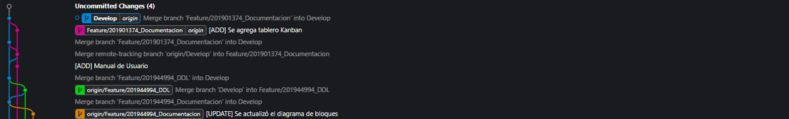
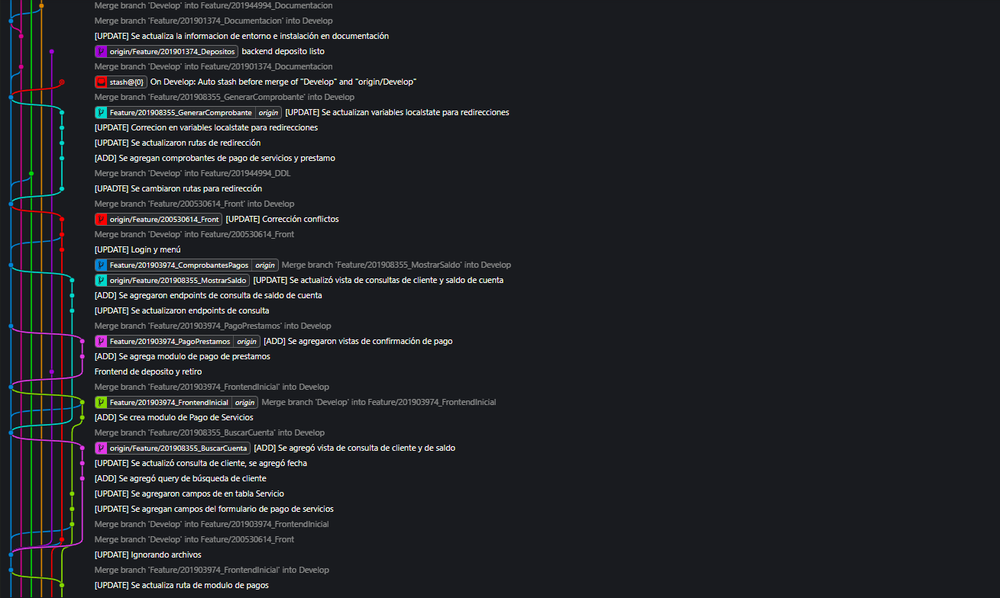
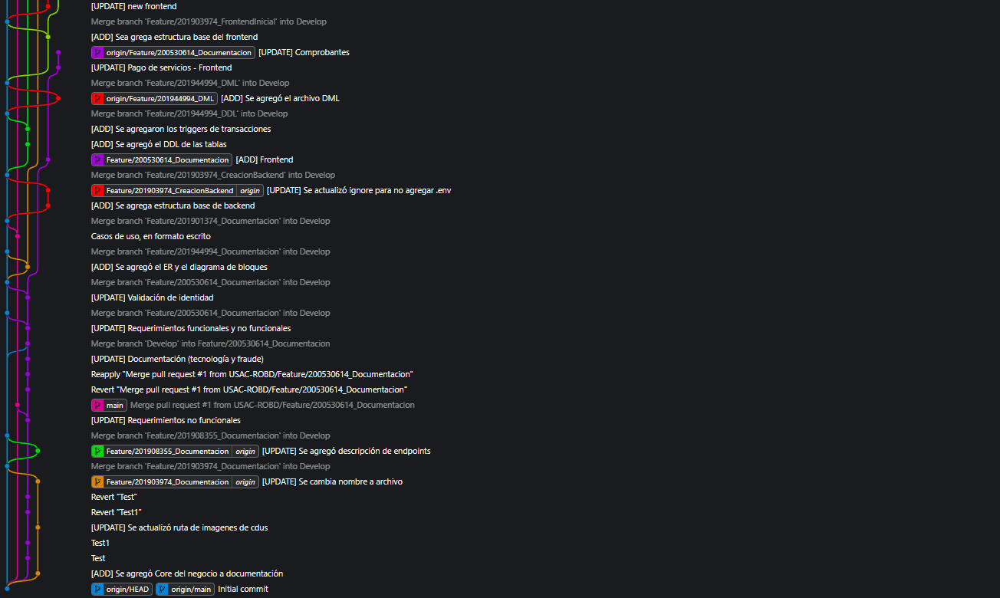

# Estrategia Branching - Money Bin - Grupo 7

## Gitflow

Para este proyecto se utilizo gitflow con la siguiente estructura de ramas:

    * main
    * Develop
    * Feature/carnet_nombreFeature

### Argol de Ramas:

 
 
 