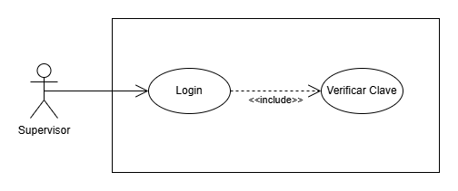

# Manual Tecnico - Proyecto - Grupo 7
# Money Bin

## 1. Antecedentes

## 2. Core del negocio
### Descripcion
### CDU de Alto nivel
### CDU Primera Descomposición

## 3. Requerimientos Funcionales
### RF-4.1 - Login de Supervisor
El supervisor del sistema debe poder hacer login al sistema y posteriormente validar su identidad por medio de una clave tipo `.pem`.

### RF-4.2 - Modificar información del empleado
El supervisor debe poder actualizar la información del empleados en caso de ser requerido. De igual forma, si el empleado requiere un cambio de contraseña, el administrador puede enviar una notificación con una nueva, siempre y cuando el empleado no haya solicitado una contraseña mas de 3 veces, de otra forma, el empleado será despedido.

### RF-4.3 - Aceptar Prestamo
El supervisor debe poder aceptar o rechazar las solicitudes de prestamos de los clientes, simpre y cuando el sistema valide que el cliente no tiene ninguna solicitud o prestamos pendiente.

### RF-4.4 - Revisar encuestas de satisfacción
El supervisor deberá poder revisar las encuestas de satisfacción que los clientes hubiesen respondido, para poder encontrar puntos de mejora.

### RF-4.5 - Ver registros de quejas
El supervisor deberá poder revisar todas la quejas que los usuarios hubiesen presentado sobre los servicios y así poder evaluar puntos de mejora.

### RF-4.6 - Registro de administradores
El supervisor deberá poder crear los usuarios de los administradores del sistemas, para dicha acción deberá poder completar y cargar toda la información necesaria. Posteriormente el sistema debe enviar al administrador un usuario de confirmación con su nuevo usuario y su contraseña, además el sistema debe implementar una autenticación de 2 factores para el usuario administrador.

### RF-4.7 - Ver información de los administradores del sistema
El supervisor deberá poder ver, editar o eliminar cualquier información de los usuarios administradores del sistema. De igual forma, el sistema debe notificar al usuario administrador sobre cualquier cambio realizado sobre su perfil.

### RF-4.8 - Monitoreo de actividad en tiempo real
El administrador deberá poder revisar en tiempo real ciertas activdades del sistema como por ejemplo, retiros, solicitudes de préstamos, bloque y activación de tarjetas, actividades realizadas por los administradores (registros de empleados, asignación de roles, eliminación de empleados, cambios de contraseñas de empleados). El supervisor deberá poder contar con filtros para los datos en tiempo real, además, el sistema deberá poder alertar al supervisor sobre posibles actividades anormales.

### RF-4.9 - Gestión de inventarios bancarios
El administrador deberá poder realizar gestiones sobre el efectivo y otros recursos de la sucursal. Además deberá poder visualizar las entradas y salidas de dinero en tiempo real. De igual forma, deberá poder ver reportes del dinero que posee el banco (dolares y quetzales), salidas y entrada de dinero con filtros, ganancias o pérdidas a lo largo del tiempo.

### RF-4.10 - Aprobación de tarjetas
El supervisor deberá poder aprobar o rechazar las solicitudes de tarjetas (credito, o debito) de los clientes. Par poder tomar la decisión deberá poder visualizar toda la información y record financiero del cliente.

### RF-4.11 - Aprobación de solicitudes de cancelación de servicios
El supervisor será el encargado de aprobar o rechazar las solicitudes de cancelación de servicios de los clientes. Previo a esto, debe validar que todo este en orden para proceder con la cancelación, de igual forma, si el sistema verifica que hay inconvenientes no debe permitir realizar la cancelación del servicio.

### RF-4.12 - Reportes
El supervisor deberá poder visualizar una serie de reportes que le facilitarán la toma de decisiones respecto al banco y sus actividades.

## 4. Requerimientos no funcionales

## 5. CDU Expandidos
### CDU-4.1 - Login de Supervisor

## 6. Matrices de Trazabilidad
### Stakeholders vrs Requerimientos
### Stakeholders vrs CDU
### Requerimientos vrs CDU

## 7. Diagramas
### Diagrama de Componentes
### Diagrama de Despliegue

## 8. Diagrama Entidad Relación

## 9. Prototipos

## 10. Patrones de Diseño

## 11. Tablero Kanban