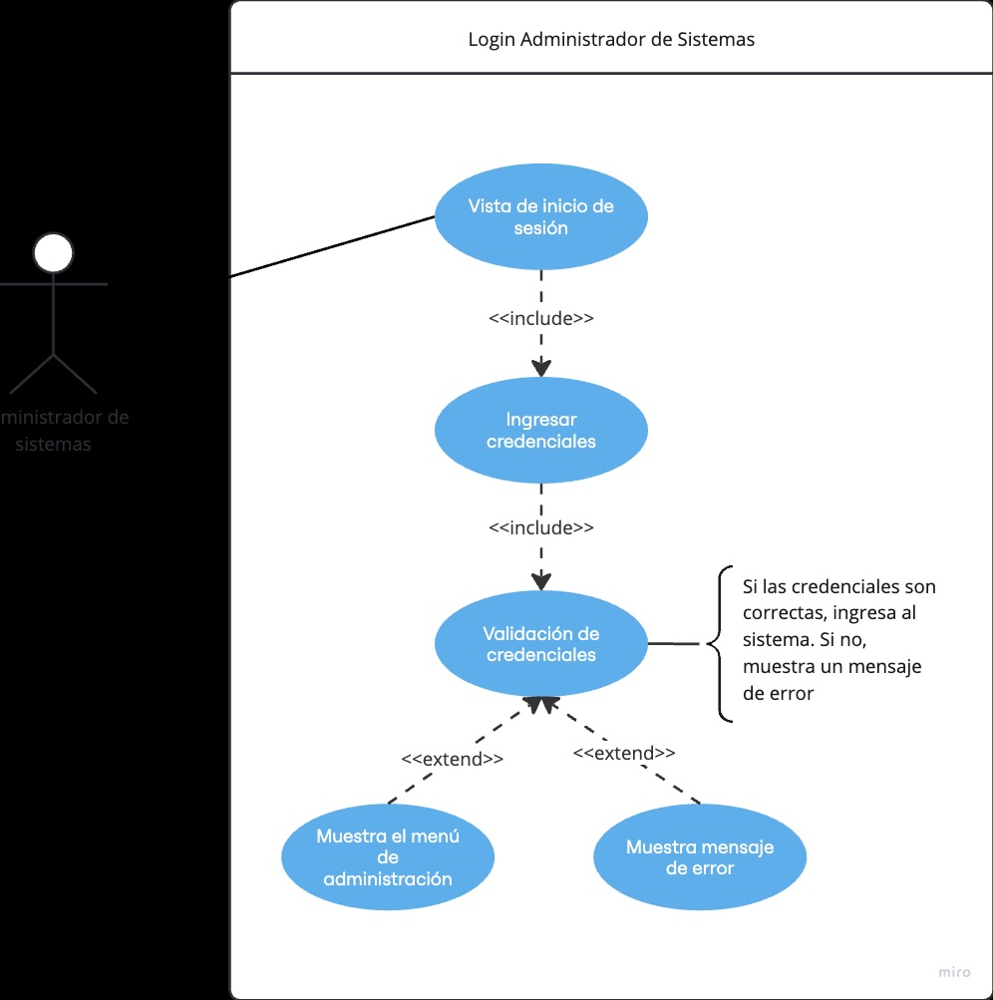
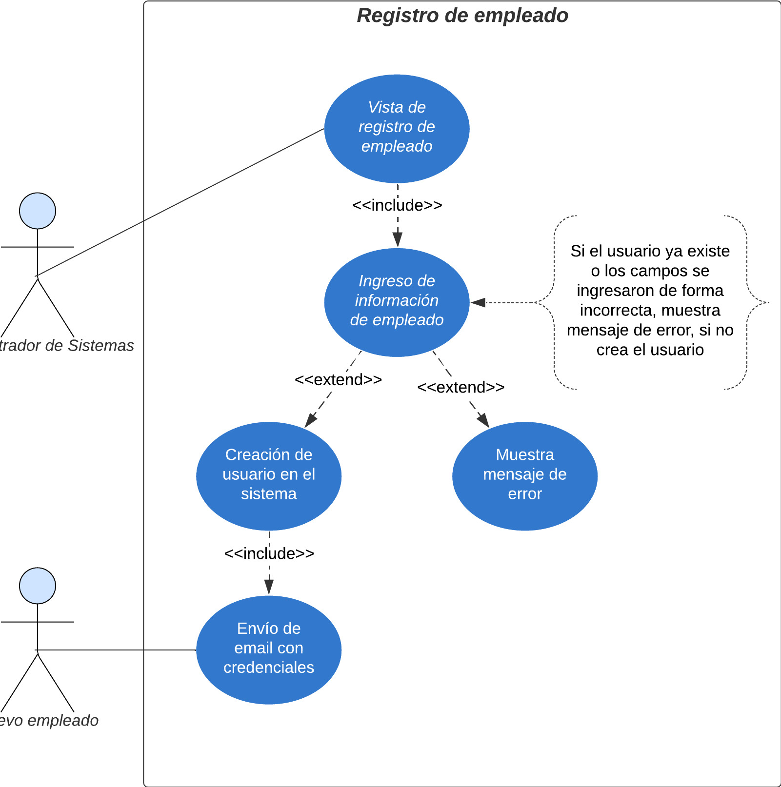
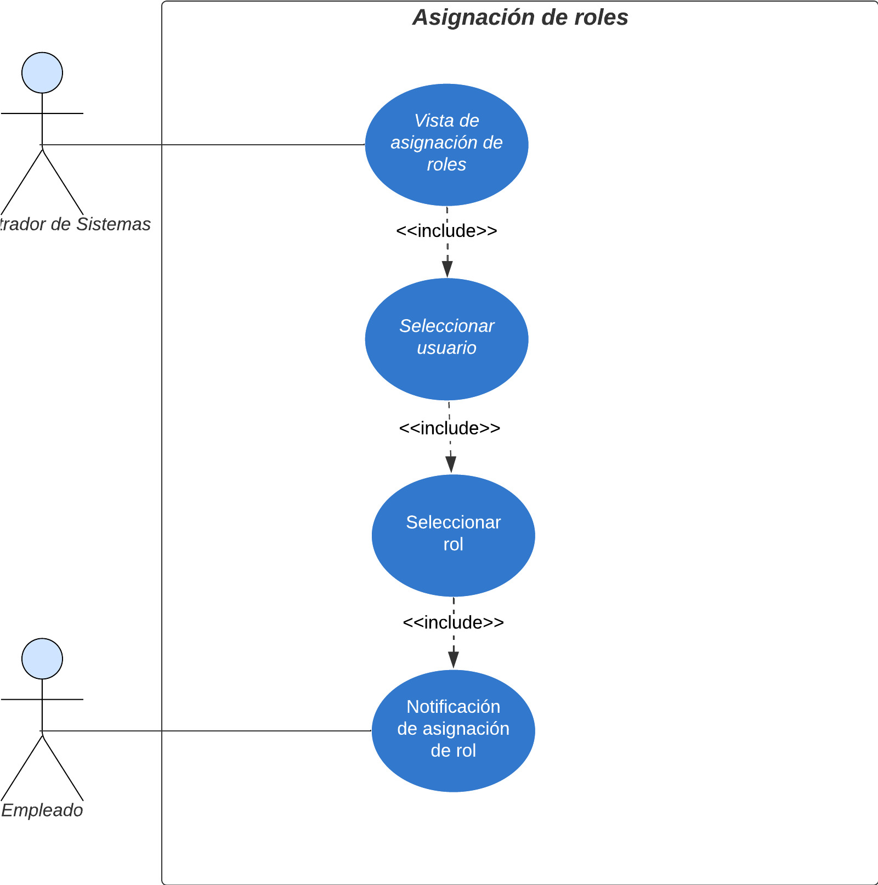
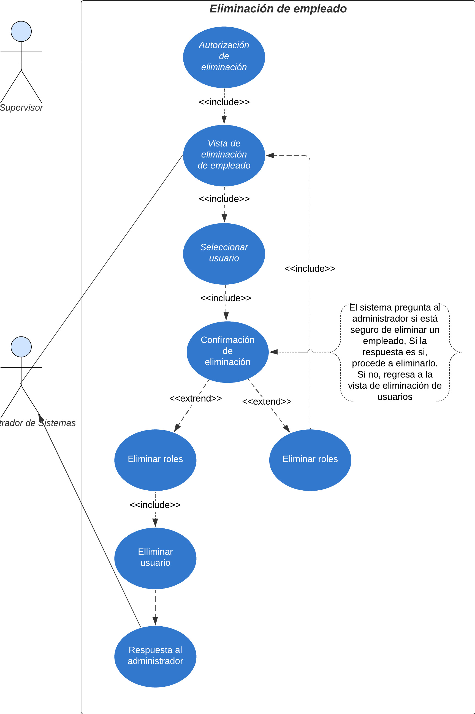
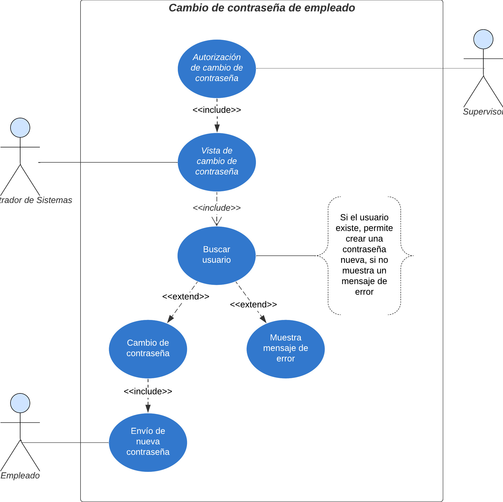
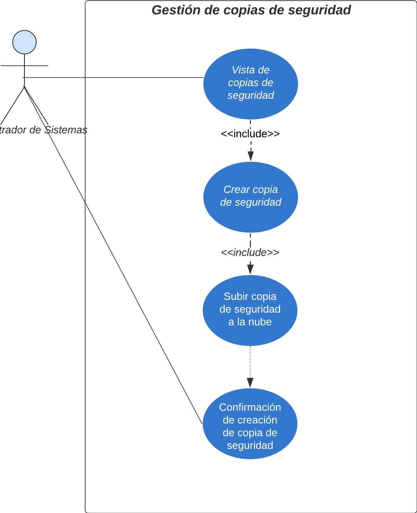

# Manual Tecnico - Proyecto - Grupo 7

## Módulo Administrador de Sistemas

Administrador de sistemas.

### CDU alto nivel

1. Login

2. Registrar empleado

3. Asignación de roles

4. Eliminar empleados

5. Cambio de contraseña de empleado

6. Gestión de copias de seguridad.

### CDU expandidos

Casos de uso expandidos

### Requerimientos funcionales

#### RF-01. Inicio de sesión de administrador de sistema

- El sistema debe permitir que el administador de sistemas inicie sesión por medio de correo electrónico y contraseña

#### RF-02. Creación de nuevo empleado

- El sistema debe permitir que un usuario administrador cree nuevos empleados.

#### RF-03. Asignación de roles

- El sistema debe permitir agregar o cambiar el rol de un empleado

#### RF-04. Eliminar empleados

- El sistema debe permitir que un usuario administrador elimine empleados
  - Un usuario supervisor debe autorizar la eliminación del usuario
- El sistema debe permitir que el administrador adjunte la autorización de eliminación en un archivo PDF

#### RF-05. Cambio de contraseña de empleado

- El sistema debe permitir que un usuario administrador cambie la contraseña de un empleado
  - Un usuario supervisor debe autorizar el cambio de contraseña

#### RF-06. Gestión de copias de seguridad

- El sistema debe permitir que un usuario administrador cree copias de seguridad de la base de datos
  - Las copias de seguridad deben almacenarse en la nube y estar disponibles ante cualquier eventualidad

### Requerimientos no funcionales

#### RN-01. Escalabilidad

- El sistema debe tener la capacidad de aumentar el espacio en la nube, según necesidad de almacenamiento.

#### RN-02. Disponibilidad

- El sistema debe estar disponible 24/7.

#### RN-03. Seguridad

- El sistema debe encriptar partes de la base de datos que contengan información sensible, tales como: nombre de usuario y contraseña.

## CDU EXPANDIDOS

### CDU 01: Inicio de sesión (Login)

**ID:** CDU-01  
**Nombre:** Inicio de sesión
**Actor Principal:** Administrador de sistemas
**Propósito:** Permite a un administrador de sistemas acceder al sistema por medio de sus credenciales
**Resumen:** El administrador podrá iniciar sesión al sistema por medio de las credenciales que le han sido otorgadas.

#### Flujo Principal

1. El administrador de sistemas abre la pantalla de inicio de sesión.
2. El sistema muestra los campos para ingresar:
   - Correo y contraseña.
3. El administrador de sistemas ingresa las credenciales.
4. El sistema valida las credenciales.
5. Si las credenciales son válidas, el administrador de sistemas accede a la plataforma.
6. El sistema muestra el menú principal con las opciones que el administrador de sistemas tiene activas.

#### Flujo Alternativo

- **Credenciales inválidas:**
  1. El sistema muestra un mensaje de error.
  2. El administrador de sistemas tiene la opción de reintentar.

**Postcondición:** El administrador accede al sistema o recibe un mensaje indicando que sus credenciales son incorrectas.

---

### CDU 02: Registrar empleado

**ID:** CDU-02
**Nombre:** Registrar empleado
**Actor Principal:** Administrador de sistemas
**Propósito:** Permite a un administrador de sistemas crear nuevos usuarios en el sistema
**Resumen:** El adminisrador accede a la vista de creación de empleados y completa los datos requeridos.

#### Flujo Principal

1. El administrador de sistemas abre el módulo de empleados > registro de empleados
2. El sistema muestra los campos para ingresar:
   - Nombre completo
   - Número de teléfono
   - Edad
   - Numero de DPI
   - Correo electrónico
   - Papelería completa (PDF)
   - Fotografía
   - Genero
   - Estado Civil
3. El sistema valida la información ingresada
4. Si la información es correcta, el sistema crea el nuevo usuario
5. El sistema envía las credenciales al nuevo empleado por correo electrónico

#### Flujo Alternativo

- **Información incorrecta o usuario existente:**
  1. El sistema muestra un mensaje de error.
  2. El administrador de sistemas tiene la opción de reintentar.

**Postcondición:** Se crea el usuario o el administrador de sistemas recibe un mensaje indicando que sus credenciales son incorrectas.

---

### CDU 03: Asignación de roles

**ID:** CDU-03
**Nombre:** Asignación de roles
**Actor Principal:** Administrador de sistemas
**Propósito:** Permite a un administrador de sistemas asignar roles a los empleados
**Resumen:** El adminisrador accede a la vista de asignación de roles y selecciona los roles que que un empleado debe tener, según sus funciones

#### Flujo Principal

1. El administrador de sistemas abre el módulo de empleados > asignación de roles
2. El sistema permite buscar a un empleado
3. El administrador de sistemas elige el usuario al que desea modificarle el rol
4. El sistema permite seleccionar o quitar la selección de los roles disponibles
5. El sistema asigna al rol y notifica que la asignación fue exitosa

#### Flujo Alternativo

- **Usuario no existente:**
  1. El sistema muestra un mensaje de usuario/empleado no encontrado.
  2. El administrador de sistemas tiene la opción de modificar la búsqueda.

**Postcondición:** Se asignan los roles al empleado o el administrador de sistemas recibe un mensaje indicando que el usuario que busca no existe.

---

### CDU 04: Eliminar empleados

**ID:** CDU-04
**Nombre:** Eliminar empleados
**Actor Principal:** Administrador de sistemas
**Propósito:** Permite a un administrador de sistemas eliminar empleados del sistema
**Resumen:** El adminisrador accede a la vista de eliminación de empleados, busca y elimina el usuario deseado. Un supervisor debe autorizar esta acción

#### Flujo Principal

1. Un supervisor autoriza la eliminación de un empleado
2. El administrador de sistemas abre el módulo de empleados > eliminación
3. El sistema permite buscar a un empleado
4. El administrador de sistemas elige el usuario que debe eliminar
5. El sistema pregunta si el administrador de sistemas desea eliminar al usuario
6. El administrador de sistemas seleccióna si está seguro de eliminar al usuario
7. Si el administrador de sistemas confirma la eliminación del usuario, el sistema elimina el usuario.

#### Flujo Alternativo

- **Administrador de sistemas no confirma la eliminación:**
  1. El administrador de sistemas selecciona que no está seguro de eliminar al usuario
  2. El sistema cancela la transacción y regresa a la pantalla principal del módulo de empleados.

**Postcondición:** Se elimina al usuario existente o se reresa a a la pantalla principal del módulo de empleados.

---

### CDU 05: Cambio de contraseña de empleado

**ID:** CDU-05
**Nombre:** Cambio de contraseña de empleado
**Actor Principal:** Administrador de sistemas
**Propósito:** Permite a un administrador de sistemas cambiar la contraseña de un empleado
**Resumen:** El adminisrador accede a la vista de cambio de contraseña y realiza el cambio, siempre y cuando un supervisor haya autorizado el cambio

#### Flujo Principal

1. Un supervisor autoriza el cambio de contraseña
2. El administrador de sistemas abre el módulo de empleados > cambio de contraseña
3. El sistema permite buscar a un empleado
4. El administrador de sistemas elige el usuario al que debe cambiarle la contraseña
5. El administrador de sistemas cambia la contraseña del empleado
6. El sistema guarda la nueva contraseña y envía un correo electrónico al usuario con la nueva contraseña

#### Flujo Alternativo

- **El usuario no existe:**
  1. El usuario buscado por el administrador de sistemas no existe
  2. El sistema muestra un mensaje de error

**Postcondición:** Se cambia la contraseña del usuario o se permite modificar la búsqueda

---

### CDU 06: Gestión de copias de seguridad

**ID:** CDU-06
**Nombre:** Gestión de copias de seguridad
**Actor Principal:** Administrador de sistemas
**Propósito:** Permite a un administrador de sistemas crear copias de seguridad
**Resumen:** El adminisrador accede a la vista de copias de seguridad y realiza una nueva copia de seguridad

#### Flujo Principal

1. El administrador de sistemas ingresa al módulo de copias de seguridad
2. El sistema permite crear una nueva copia
3. El administrador de sistemas elige crear una nueva copia de seguiridad de la base de datos
4. El sistema realiza la copia de seguridad y la sube a la nube

**Postcondición:** Se realiza una copia de seguridad y se sube a la nube.

---
