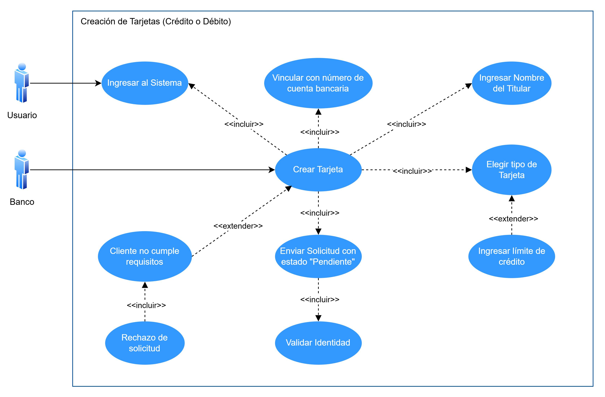

# Manual Tecnico - Proyecto - Grupo 7

### CDU de Alto nivel

#### Módulo de Atención al Cliente
1. Creacion de Cuenta Bancaria Normal y en Dólares

2. Actualización de Datos del Cliente

3. Creación de Tarjetas de Crédito o Débito

4. Bloqueo de Tarjetas de Crédito o Débito

5. Solicitud de Cancelación de Cuenta o Tarjeta

6. Encuesta de Satisfacción

7. Solicitud de Préstamo

8. Registro de Quejas

## Requerimientos Funcionales

### Rol Atención al Cliente

#### RF-11. Creación de Cuenta Bancaria Normal y en Dólares

- El empleado del banco encargado de la atención al cliente debe tener un módulo específico para crear nuevas cuentas bancarias en el sistema.
- Las cuentas pueden ser de dos tipos distintos:
  - Con tipo de moneda de cambio local.
  - Con tipo de moneda de cambio en dólares.
- Debe ingresarse los datos del cliente vinculado, seleccionar si la cuenta es monetaria o de ahorro y el monto inicial.
- Debe hacerse una validación de identidad para completar el proceso.

#### RF-12. Actualización de Datos del Cliente

- Debe haber un módulo para el encargado de atención al cliente para actualizar datos de los clientes.
- Debe verificarse la identidad del cliente respondiendo la pregunta de seguridad registrada durante la creación de la cuenta bancaria.
- Al completar el proceso debe guardarse en el historial los cambios realizados incluyendo la fecha y hora.

#### RF-13. Creación de Tarjetas de Crédito o Débito

- Debe ser posible para el encargado de atención al cliente crear nuevas tarjetas de crédito o débito.
- Para completar el proceso debe enviarse la solicitud con estado pendiente al supervisor para que pueda aprobarla o rechazarla.
- Antes de enviar la solicitud debe realizarse una verificación de identidad.

#### RF-14. Bloqueo de Tarjetas de Crédito o Débito

- Debe existir un módulo para que el encargado de atención al cliente pueda realizar bloqueos a tarjetas de crédito o débito por cualquiera de los motivos siguientes:
  - Robo.
  - Pérdida.
  - Fraude.
- Para completar el proceso debe notificarse al titular de la tarjeta del bloqueo exitoso y generar un reporte al equipo correspondiente para el análisis de fraude, en caso de ser necesario.

#### RF-15. Solicitud de Cancelación de Cuenta o Tarjeta

- El empleado encargado de atención al cliente debe poder emitir solicitudes de cancelación de cuentas o tarjetas de crédito o débito.
- Debe enviarse la solicitud con estado pendiente al supervisor para que pueda aprobarla o rechazarla.
- Para completar el proceso es necesario que el supervisor examine el perfil del cliente para tomar la decisión de la solicitud.

#### RF-16. Encuesta de Satisfacción

- Los clientes pueden evaluar la atención al cliente, servicios, productos, etc., mediante una encuesta.
- Al finalizar la encuesta se debe puntuar el área evaluada.
- Completada la encuesta, los datos se guardan para posteriormente realizar análisis.

#### RF-17. Solicitud de Préstamo

- El sistema debe tener un módulo de solicitud de préstamos que permite a los encargados de atención al cliente gestionar préstamos para los clientes.
- Es necesario ingresar datos como número de cuenta y monto solicitado.
- También se debe seleccionar el tipo de préstamo y el plazo en que se pagará el préstamo.
- Los clientes deberán cargar documentación requerida en PDF, y la autorización final recae en el supervisor.
- El sistema debe realizar un análisis automático de la capacidad de pago del cliente, verificando si no tiene alguna deuda actual.
- Deben establecerse tasas de interés dinámicas basadas en el historial crediticio del cliente y el tipo de préstamo.
- Las solicitudes rechazadas deben incluir una justificación clara y recomendaciones para el cliente.

#### RF-18. Registro de Quejas

- Debe permitirse registrar quejas hechas por los clientes.
- Debe registrarse los detalles de la queja, los datos importantes del cliente como su número de cuenta, etc., y el servicio del que se va a presentar la queja.
- Al completarse el registro de la queja se envía automáticamente un correo electrónico al supervisor para notificar sobre el incidente.

---

## Requerimientos No Funcionales

### Rol Atención al Cliente

#### RN-01. Seguridad
Los datos personales y financieros de los clientes deben ser cifrados tanto en tránsito como en reposo. Las preguntas de seguridad y contraseñas deben utilizar algoritmos de encriptación robustos.  
Todo acceso a módulos sensibles debe requerir autenticación y autorización, garantizando que solo usuarios válidos y con permisos adecuados puedan interactuar con el sistema.

#### RN-02. Usabilidad
La interfaz de usuario debe ser intuitiva y accesible, garantizando que los clientes puedan completar las tareas en un máximo de 3 pasos por módulo.

#### RN-03. Escalabilidad
El sistema debe ser capaz de ampliarse para soportar el crecimiento futuro del banco, permitiendo agregar nuevas funcionalidades sin afectar el rendimiento de los módulos existentes.

#### RN-04. Mantenibilidad
Debe ser posible realizar actualizaciones o correcciones sin interrumpir el servicio, utilizando un modelo de despliegue continuo (CI/CD).

#### RN-05. Auditoría y Registro
Todas las acciones realizadas en el sistema deben registrarse en un historial con detalles como fecha, hora, usuario y acción realizada.

#### RN-06. Conformidad Legal
El sistema debe cumplir con las normativas locales e internacionales aplicables, como la Ley de Protección de Datos Personales y regulaciones bancarias específicas.

## CDU Expandidos

### ROL Atención al Cliente

#### CDU-11: Creación de Cuenta Bancaria Normal y en Dólares
*ID:* CDU-11  
*Nombre:* Creación de Cuenta Bancaria Normal y en Dólares  
*Actor Principal:* Empleado de Atención al Cliente  
*Propósito:* Abrir una nueva cuenta monetaria o de ahorro con toda la información necesaria y garantizar su validación y seguridad.  
*Resumen:* El encargado de atención al cliente podrá completar un formulario con datos personales del cliente, seleccionar el tipo de cuenta y proporcionar un monto inicial. El sistema valida la información, genera un número de cuenta único y almacena los datos en la base de datos.  

##### Flujo Principal
1. El empleado accede al módulo de creación de cuentas.
2. Completa el formulario con la información requerida (nombre, apellido, CUI, etc.).
3. Selecciona el tipo de cuenta (Monetaria o Ahorro).
4. Proporciona un monto inicial.
5. Agrega una pregunta de seguridad con su respuesta.
6. El sistema valida los datos ingresados y verifica la identidad.
7. Se genera un número de cuenta único.
8. El cliente recibe la confirmación de la creación de la cuenta junto con el número generado.

##### Flujo Alternativo
- Si algún dato ingresado no cumple con las validaciones, el sistema muestra un mensaje de error, y el empleado debe corregir los datos del cliente para proceder.

---

#### CDU-12: Actualización de Datos del Cliente
*ID:* CDU-12  
*Nombre:* Actualización de Datos del Cliente  
*Actor Principal:* Empleado de Atención al Cliente  
*Propósito:* Modificar datos personales del cliente manteniendo la seguridad y un historial de cambios.  
*Resumen:* El empleado selecciona los datos que el cliente desea actualizar, verifica su identidad mediante una pregunta de seguridad y el sistema actualiza la información manteniendo un registro en el historial.    

##### Flujo Principal
1. El empleado accede al módulo de actualización de datos de clientes.
2. Ingresa el número de cuenta y selecciona los datos que desea actualizar.
3. Responde la pregunta de seguridad para verificar la identidad.
4. El sistema valida la respuesta y permite al cliente actualizar los datos.
5. El sistema guarda los cambios en el historial y confirma la actualización al cliente.

##### Flujo Alternativo
- Si la verificación de identidad falla, el sistema niega el acceso y notifica al cliente.

---

#### CDU-13: Creación de Tarjetas de Crédito o Débito
*ID:* CDU-13  
*Nombre:* Creación de Tarjetas de Crédito o Débito  
*Actor Principal:* Empleado de Atención al Cliente  
*Propósito:* Facilitar la solicitud de nuevas tarjetas de crédito o débito de manera segura.  
*Resumen:* El cliente solicita una tarjeta, el sistema valida la identidad y la información proporcionada, y la solicitud pasa a revisión por parte del supervisor para su aprobación.  

##### Flujo Principal
1. El empleado accede al módulo de solicitud de tarjetas.
2. Selecciona el tipo de tarjeta (Crédito o Débito).
3. Proporciona el número de cuenta del cliente, límite de crédito (si aplica), y datos del titular.
4. El sistema valida la información y registra la solicitud.
5. La solicitud es enviada al supervisor para su revisión y aprobación.
6. El cliente recibe una notificación del estado de la solicitud.

##### Flujo Alternativo
- Si el cliente no cumple con los requisitos, el sistema rechaza la solicitud con una justificación.

---

#### CDU-14: Bloqueo de Tarjetas de Crédito o Débito
*ID:* CDU-14  
*Nombre:* Bloqueo de Tarjetas de Crédito o Débito  
*Actor Principal:* Empleado de Atención al Cliente  
*Propósito:* Permitir a los clientes bloquear sus tarjetas de manera inmediata en caso de pérdida, robo o fraude.  
*Resumen:* El cliente solicita el bloqueo de su tarjeta indicando el motivo y verifica su identidad. El sistema bloquea la tarjeta, notifica al cliente y genera un reporte al equipo de fraude.  

##### Flujo Principal
1. El empleado accede al módulo de bloqueo de tarjetas.
2. Selecciona el tipo de tarjeta (Crédito o Débito) e ingresa el número de tarjeta.
3. Indica el motivo del bloqueo.
4. Responde la pregunta de seguridad para validar la identidad.
5. El sistema bloquea la tarjeta y envía una notificación por correo electrónico.
6. Se genera un reporte automático para el equipo de fraude.

##### Flujo Alternativo
- Si la verificación de identidad falla, el sistema no realiza el bloqueo y notifica al cliente.

---

#### CDU-15: Solicitud de Cancelación de Cuenta o Tarjeta
*ID:* CDU-15  
*Nombre:* Solicitud de Cancelación de Cuenta o Tarjeta  
*Actor Principal:* Empleado de Atención al Cliente  
*Propósito:* Permitir a los clientes solicitar la cancelación de servicios o productos financieros de forma controlada.  
*Resumen:* El cliente solicita la cancelación de un servicio proporcionando su identificación y motivo. El supervisor revisa la solicitud y confirma la cancelación después de verificar los requisitos.  

##### Flujo Principal
1. El empleado accede al módulo de cancelación de servicios.
2. Proporciona el número de cuenta o identificación del cliente.
3. Selecciona el servicio a cancelar e indica el motivo.
4. El sistema valida la solicitud y envía la información al supervisor.
5. El supervisor revisa la solicitud y confirma la cancelación.
6. El cliente recibe la notificación del estado de la solicitud.

##### Flujo Alternativo
- Si el cliente tiene saldos pendientes, el sistema rechaza la solicitud y notifica al cliente con las razones.

---

#### CDU-16: Encuesta de Satisfacción
*ID:* CDU-16  
*Nombre:* Encuesta de Satisfacción  
*Actor Principal:* Empleado de Atención al Cliente  
*Propósito:* Evaluar la calidad de los servicios del banco y recolectar datos para análisis estadísticos y retroalimentación.  
*Resumen:* Permite a los clientes calificar los servicios del banco en categorías como atención al cliente, productos y servicios. Incluye un sistema de puntuación y comentarios opcionales. Las encuestas serán realizadas por el personal de atención al cliente.  

##### Flujo Principal
1. El cliente es invitado a completar la encuesta por el personal de atención al cliente.
2. Se registra el número de cliente o identificación (opcional).
3. El cliente elige la categoría a evaluar (Atención al Cliente, Servicios, Productos, etc.).
4. Se registra la fecha y hora de la encuesta automáticamente.
5. El cliente ingresa una puntuación y puede añadir comentarios.
6. El sistema almacena los datos en la base de datos para análisis posterior.

##### Flujo Alternativo
- Si el cliente no desea proporcionar su número de cliente o identificación, la encuesta puede completarse de forma anónima.

---

#### CDU-17: Solicitud de Préstamo
*ID:* CDU-17  
*Nombre:* Solicitud de Préstamo  
*Actor Principal:* Empleado de Atención al Cliente  
*Propósito:* Permitir a los clientes solicitar préstamos personales, hipotecarios, vehiculares u otros de forma transparente y segura.  
*Resumen:* Este módulo recopila información necesaria para que los clientes soliciten préstamos. Incluye validaciones, análisis de capacidad de pago y procesos de autorización supervisados.  

##### Flujo Principal
1. El empleado accede al módulo y proporciona el número de cuenta o identificación del cliente.
2. Selecciona el tipo de préstamo (Personal, Hipotecario, Vehicular, Educativo, etc.).
3. Indica el monto solicitado y el plazo del préstamo.
4. Sube la documentación requerida en formato PDF (comprobantes de ingresos, garantías, identificación).
5. El sistema registra la fecha y hora de la solicitud.
6. Se realiza un análisis automático de la capacidad de pago y se calcula una tasa de interés dinámica.
7. El estado inicial de la solicitud se marca como "Pendiente".
8. Un supervisor revisa la solicitud y cambia el estado a "Aprobado" o "Rechazado".
9. Si la solicitud es rechazada, el cliente recibe una justificación con recomendaciones.

##### Flujo Alternativo
- El sistema notifica al cliente para que suba los documentos faltantes antes de continuar.
- Si el análisis automático determina que el cliente no puede asumir el préstamo, la solicitud se rechaza automáticamente con una notificación clara al cliente.

---

#### CDU-18: Registro de Quejas
*ID:* CDU-18  
*Nombre:* Registro de Quejas  
*Actor Principal:* Empleado de Atención al Cliente  
*Propósito:* Permitir a los clientes registrar quejas relacionadas con los servicios del banco, para su atención y resolución priorizada.  
*Resumen:* Los clientes pueden registrar quejas clasificadas por tipo y detallar su problema. El sistema almacena la información y notifica al supervisor para su seguimiento.  

##### Flujo Principal
1. El empleado accede al módulo y proporciona el número de cuenta o identificación del cliente.
2. Selecciona el tipo de queja (Servicio, Producto, Atención al Cliente, etc.).
3. Describe los detalles de la queja.
4. El sistema registra la fecha y hora del registro.
5. La información es enviada automáticamente al supervisor por correo electrónico.
6. La queja es categorizada y priorizada para su atención.

##### Flujo Alternativo
- Si el cliente no proporciona su número de cuenta o identificación, la queja puede ser registrada de forma anónima, pero será más difícil darle seguimiento.

## Patrones de Diseño

### Proxy
El patrón Proxy actúa como un intermediario o representante para otro objeto, permitiendo controlar el acceso a él. El objetivo principal es ofrecer una capa adicional de control antes de interactuar con el objeto real, ya sea para verificar permisos, optimizar recursos, o agregar funcionalidades sin modificar la implementación original.

Caractersticas:

- **Intermediario**: Proporciona una capa de acceso indirecto al objeto real.
- **Control de acceso**: Puede restringir o condicionar las operaciones en función de reglas predefinidas.
- **Desacoplamiento**: Separa la lógica del cliente y del objeto real, manteniendo el sistema modular.

#### Implementación
- Validación de identidad en operaciones sensibles:
    - Para Actualización de datos, bloqueo de tarjetas, y cancelación de servicios.
    - Un Protection Proxy verifica que el cliente esté autorizado para realizar la operación (por ejemplo, usando una pregunta de seguridad).
- Optimización en la creación de recursos:
    - Para Creación de cuentas o tarjetas.
    - Un Virtual Proxy asegura que el número de cuenta o tarjeta solo se genere tras completar validaciones previas.

#### Ventajas
- Protege recursos críticos mediante validaciones antes de otorgar acceso.
- Facilita la extensión o modificación de funcionalidades sin afectar directamente al objeto real.
- Proporciona un punto de acceso global en la aplicación para que sea facil de usar.
- Mantiene el código del objeto real más limpio y enfocado en sus funciones principales.