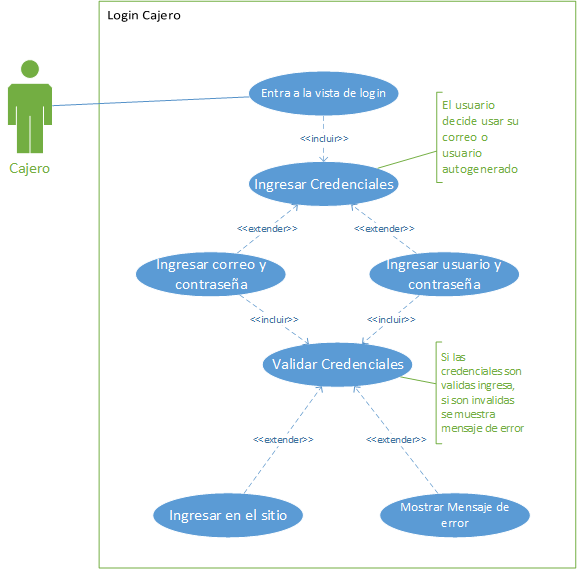
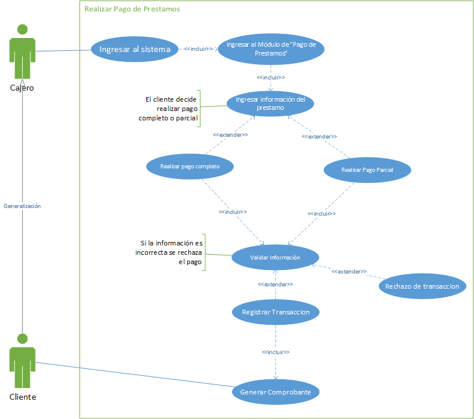
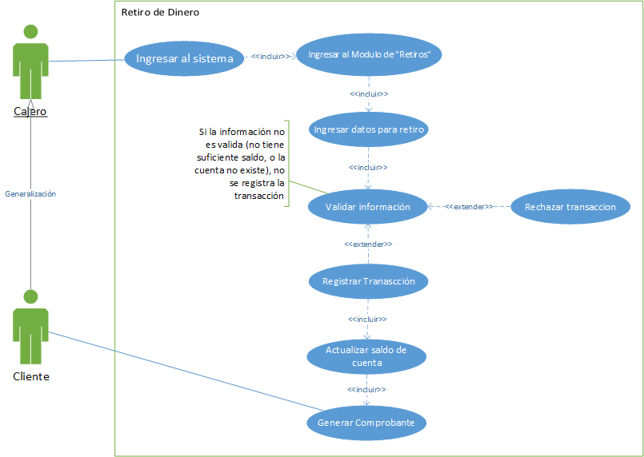
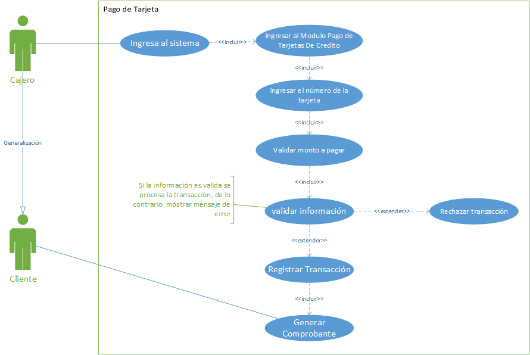

# Manual Tecnico - Proyecto - Grupo 7

## ANTECEDENTES

## CORE DEL NEGOCIO

### DESCRIPCIÓM

### CDU ALTO NIVEL

#### Primera Descomposición

#### ROL CAJERO

##### 1. Login

##### 2. Pago de Servicios

##### 3. Pago de Prestamos

##### 4. Busqueda Clientes

##### 5. Consulta de Saldo

##### 6. Cambio de Moneda

##### 7. Retiros

##### 8. Depositos

##### 9. Pago Tarjeta

#### ROL SERVICIO AL CLIENTE

#### ROL SUPERVISOR

#### ROL ADMON SISTEMAS

## REQUERIMIENTOS FUNCIONALES

### ROL CAJERO  

#### RF-01. Gestión de Acceso: Login

- El sistema debe permitir al cajero iniciar sesión utilizando:
  - Correo y contraseña registrados.
  - Nombre de usuario autoasignado.
- Validación de credenciales para garantizar la seguridad del acceso.

#### RF-02. Pago de Servicios

- El sistema debe permitir al cajero registrar pagos de servicios básicos como agua, luz, teléfono e internet.
- **Para pagos en efectivo**, debe solicitar:
  - Nombre del titular del servicio.
  - Código de servicio.
  - Monto a pagar.
- **Para pagos desde una cuenta bancaria**, debe solicitar:
  - Nombre del titular del servicio.
  - Código de servicio.
  - Monto a pagar.
  - Número de cuenta.
  - DPI del titular de la cuenta.
- Validar que la persona que realiza el pago sea el titular de la cuenta bancaria.

#### RF-03. Pago de Préstamos

- Registrar pagos parciales o totales de préstamos adquiridos.
- Solicitar:
  - Número de cuenta.
  - Número de préstamo.
  - Monto a pagar.
  - Fecha del pago.
- Actualizar el saldo del préstamo correspondiente.

#### RF-04. Búsqueda de Clientes

- Permitir la búsqueda de clientes por número de cuenta o CUI.
- Mostrar:
  - Perfil del cliente.
  - Detalles de contacto.
  - Historial de transacciones.

#### RF-05. Consulta de Saldo

- Mostrar el saldo actual disponible de una cuenta.
- Incluir la fecha y hora de la última actualización.

#### RF-06. Cambio de Moneda

- Permitir el cambio de quetzales a dólares bajo las siguientes restricciones:
  - Límite de Q 10,000.00 por día.
  - Solo puede realizarse una vez al mes.

#### RF-07. Generación de Comprobantes

- Generar un comprobante en PDF para cada transacción con la siguiente información:
  - Número de cuenta (si aplica).
  - Tipo de transacción.
  - Fecha y hora.
  - Monto.
  - Nombre y firma digital del cajero autorizado.

#### RF-08. Retiro de Dinero

- Registrar retiros de efectivo desde cuentas bancarias.
- Solicitar:
  - Número de cuenta.
  - Monto a retirar.
  - Fecha y hora del retiro.
  - Tipo de cuenta (monetaria o de ahorro).
  - Moneda del retiro (quetzales o dólares).
- Implementar límites de retiro y validaciones de identidad.

#### RF-09. Depósito de Dinero

- Registrar depósitos en cuentas bancarias.
- Solicitar:
  - Número de cuenta.
  - Monto a depositar.
  - Fecha y hora del depósito.
  - Tipo de cuenta (monetaria o de ahorro).
  - Moneda del depósito (quetzales o dólares).
- Validar que el módulo de depósitos en dólares esté activado.

#### RF-10. Pago de Tarjetas de Crédito

- Registrar pagos de tarjetas de crédito.
- Calcular los cargos mensuales de Q 75.00 y los intereses simples del 5% en caso de atrasos.

---

## REQUERIMIENTOS NO FUNCIONALES

### RN-01. Rendimiento

- El sistema debe procesar transacciones en tiempo real con un tiempo de respuesta máximo de 2 segundos por operación.

### RN-02. Seguridad

- Todas las transacciones deben estar cifradas.
- Validación estricta de identidad para prevenir fraudes en retiros, pagos y depósitos.

### RN-03. Disponibilidad

- El sistema debe estar disponible al 99.9% del tiempo para garantizar la continuidad operativa en horario laboral.

### RN-04. Usabilidad

- La interfaz debe ser intuitiva y permitir la navegación rápida entre módulos.
- Proporcionar mensajes claros de error y confirmación para cada operación.

### RN-05. Escalabilidad

- El sistema debe ser capaz de manejar un crecimiento en el número de usuarios y transacciones sin afectar el rendimiento.

### RN-06. Compatibilidad

- El sistema debe ser compatible con los navegadores modernos y dispositivos utilizados por los cajeros.

### RN-07. Mantenibilidad

- El sistema debe estar diseñado con una arquitectura modular que facilite futuras actualizaciones y mantenimiento.

### RN-08. Conformidad Legal

- El sistema debe cumplir con las regulaciones locales e internacionales aplicables al manejo de datos bancarios y transacciones financieras.

## CDU EXPANDIDOS

### CDU 01: Gestión de Acceso (Login)

**ID:** CDU-01  
**Nombre:** Gestión de Acceso  
**Actor Principal:** Cajero bancario  
**Propósito:** Permitir al cajero iniciar sesión en el sistema de forma segura.  
**Resumen:** El cajero podrá iniciar sesión utilizando sus credenciales registradas en el sistema.  

#### Flujo Principal

1. El cajero abre la pantalla de inicio de sesión.
2. El sistema muestra los campos para ingresar:
   - Correo y contraseña, o
   - Nombre de usuario autoasignado y contraseña.
3. El cajero ingresa las credenciales.
4. El sistema valida las credenciales.
5. Si las credenciales son válidas, el cajero accede a la plataforma.

#### Flujo Alternativo

- **Credenciales inválidas:**
  1. El sistema muestra un mensaje de error.
  2. El cajero tiene la opción de reintentar.

**Postcondición:** El cajero accede al sistema o recibe un mensaje indicando que sus credenciales son incorrectas.  

---

### CDU 02: Pago de Servicios

**ID:** CDU-02  
**Nombre:** Pago de Servicios  
**Actor Principal:** Cajero bancario  
**Propósito:** Registrar pagos de servicios básicos en el sistema.  
**Resumen:** El cajero podrá procesar pagos de servicios básicos como agua, luz, teléfono e internet.

#### Flujo Principal (Pagos en Efectivo)

1. El cajero selecciona el módulo de "Pago de Servicios".
2. El sistema muestra el formulario de pago.
3. El cajero ingresa los siguientes datos:
   - Nombre del titular del servicio.
   - Código del servicio.
   - Monto a pagar.
4. El sistema valida los datos y registra el pago.
5. El sistema genera un comprobante en PDF.

#### Flujo Principal (Pagos desde Cuenta Bancaria)

1. El cajero selecciona el módulo de "Pago de Servicios".
2. El sistema muestra el formulario de pago desde cuenta bancaria.
3. El cajero ingresa los siguientes datos:
   - Nombre del titular del servicio.
   - Código del servicio.
   - Monto a pagar.
   - Número de cuenta.
   - DPI del titular de la cuenta.
4. El sistema valida que la cuenta y el DPI coincidan con el titular.
5. Si es válido, el sistema registra el pago y genera un comprobante.

#### Flujo Alternativo  

- **Datos inválidos:**  
  1. El sistema muestra un mensaje de error y solicita corregir la información.  

**Postcondición:** El pago queda registrado y el cliente recibe el comprobante correspondiente.  

---

### CDU 03: Pago de Préstamos

**ID:** CDU-03  
**Nombre:** Pago de Préstamos  
**Actor Principal:** Cajero bancario  
**Propósito:** Registrar pagos de préstamos adquiridos por los clientes.  
**Resumen:** El cajero puede procesar pagos parciales o totales de préstamos.  

#### Flujo Principal

1. El cajero selecciona el módulo de "Pago de Préstamos".
2. El sistema muestra el formulario de pago.
3. El cajero ingresa los siguientes datos:
   - Número de cuenta.
   - Número de préstamo.
   - Monto a pagar.
   - Fecha del pago.
4. El sistema valida los datos.
5. Si los datos son válidos, el sistema registra el pago y actualiza el saldo del préstamo.
6. El sistema genera un comprobante en PDF.

#### Flujo Alternativo

- **Datos inválidos:**  
  1. El sistema muestra un mensaje de error y permite reintentar.  

**Postcondición:** El pago del préstamo queda registrado correctamente.  

---

### CDU 04: Búsqueda de Clientes

**ID:** CDU-04  
**Nombre:** Búsqueda de Clientes  
**Actor Principal:** Cajero bancario  
**Propósito:** Permitir la búsqueda de clientes mediante número de cuenta o CUI.  
**Resumen:** El cajero puede localizar la información de un cliente de manera rápida y precisa.  

#### Flujo Principal

1. El cajero selecciona el módulo de "Búsqueda de Clientes".
2. El sistema solicita el número de cuenta o CUI.
3. El cajero ingresa el dato de búsqueda.
4. El sistema busca en la base de datos y muestra:
   - Perfil del cliente.
   - Detalles de contacto.
   - Historial de transacciones.

#### Flujo Alternativo

- **Cliente no encontrado:**  
  1. El sistema muestra un mensaje indicando que no hay coincidencias.  

**Postcondición:** El cajero accede a la información del cliente o recibe un mensaje de error.  

---

### CDU 05: Consulta de Saldo

**ID:** CDU-05  
**Nombre:** Consulta de Saldo  
**Actor Principal:** Cajero bancario y cliente  
**Propósito:** Mostrar el saldo actual disponible en una cuenta.  
**Resumen:** El cajero puede consultar el saldo de una cuenta bancaria en nombre del cliente.  

#### Flujo Principal

1. El cajero selecciona el módulo de "Consulta de Saldo".
2. El sistema solicita el número de cuenta del cliente.
3. El cajero ingresa el número de cuenta.
4. El sistema muestra:
   - Saldo actual.
   - Fecha y hora de la última actualización.

#### Flujo Alternativo

- **Número de cuenta inválido:**  
  1. El sistema muestra un mensaje de error.  

**Postcondición:** El sistema muestra el saldo de la cuenta o un mensaje de error.  

---

### CDU 06: Cambio de Moneda

**ID:** CDU-06  
**Nombre:** Cambio de Moneda  
**Actor Principal:** Cajero bancario  
**Propósito:** Permitir al cliente realizar el cambio de quetzales a dólares.  
**Resumen:** El cajero procesa el cambio de moneda bajo las restricciones definidas.  

#### Flujo Principal

1. El cajero selecciona el módulo de "Cambio de Moneda".
2. El sistema solicita los datos de la cuenta del cliente.
3. El cajero ingresa:
   - Número de cuenta.
   - Monto a cambiar.
4. El sistema valida que:
   - El monto no exceda Q 10,000.00.
   - El cliente no haya realizado un cambio este mes.
5. Si es válido, el sistema realiza el cambio y actualiza el saldo de la cuenta.

#### Flujo Alternativo

- **Restricciones no cumplidas:**  
  1. El sistema muestra un mensaje de error.  

**Postcondición:** El cambio de moneda queda registrado correctamente.  

---

### CDU 07: Generación de Comprobantes

**ID:** CDU-07  
**Nombre:** Generación de Comprobantes  
**Actor Principal:** Sistema bancario  
**Propósito:** Generar un comprobante en PDF para cada transacción.  
**Resumen:** El sistema genera comprobantes de las operaciones realizadas.  

#### Flujo Principal

1. Al finalizar cualquier transacción, el sistema recopila los datos necesarios:
   - Número de cuenta (si aplica).
   - Tipo de transacción.
   - Fecha y hora.
   - Monto.
   - Nombre y firma digital del cajero autorizado.
2. El sistema genera un comprobante en PDF y lo envía al cliente.

**Postcondición:** El cliente recibe un comprobante válido de la transacción.  

---

### CDU 08: Retiro de Dinero

**ID:** CDU-08  
**Nombre:** Retiro de Dinero  
**Actor Principal:** Cajero bancario  
**Propósito:** Registrar retiros de efectivo realizados por clientes.  
**Resumen:** El cajero puede procesar retiros de efectivo desde cuentas bancarias bajo las validaciones de identidad y límites establecidos.  

#### Flujo Principal

1. El cajero selecciona el módulo de "Retiro de Dinero".
2. El sistema solicita los datos del retiro.
3. El cajero ingresa:
   - Número de cuenta.
   - Monto a retirar.
   - Fecha y hora.
   - Tipo de cuenta (monetaria o de ahorro).
   - Moneda (quetzales o dólares).
4. El sistema valida que:
   - El monto no exceda los límites establecidos.
   - El cliente sea el titular de la cuenta.
5. Si los datos son válidos, el sistema registra el retiro.
6. El sistema genera un comprobante en PDF.

#### Flujo Alternativo

- **Datos inválidos o límites excedidos:**  
  1. El sistema muestra un mensaje de error e indica la causa.

**Postcondición:** El retiro queda registrado y se entrega el efectivo al cliente.  

---

### CDU 09: Depósito de Dinero

**ID:** CDU-09  
**Nombre:** Depósito de Dinero  
**Actor Principal:** Cajero bancario  
**Propósito:** Registrar depósitos realizados por clientes en sus cuentas bancarias.  
**Resumen:** El cajero puede procesar depósitos, actualizando el saldo de la cuenta en tiempo real.  

#### Flujo Principal

1. El cajero selecciona el módulo de "Depósito de Dinero".
2. El sistema solicita los datos del depósito.
3. El cajero ingresa:
   - Número de cuenta.
   - Monto a depositar.
   - Fecha y hora del depósito.
   - Tipo de cuenta (monetaria o de ahorro).
   - Moneda (quetzales o dólares).
4. El sistema valida que:
   - El cliente tenga habilitado el módulo de depósitos en dólares (si aplica).
5. Si los datos son válidos, el sistema registra el depósito y actualiza el saldo de la cuenta.
6. El sistema genera un comprobante en PDF.

#### Flujo Alternativo

- **Datos inválidos o módulo deshabilitado:**  
  1. El sistema muestra un mensaje de error y detalla el motivo.

**Postcondición:** El depósito queda registrado correctamente en el sistema.  

---

### CDU 10: Pago de Tarjetas de Crédito

**ID:** CDU-10  
**Nombre:** Pago de Tarjetas de Crédito  
**Actor Principal:** Cajero bancario  
**Propósito:** Registrar pagos de tarjetas de crédito realizadas por los clientes.  
**Resumen:** El cajero puede procesar pagos de tarjetas de crédito, incluyendo el cálculo de cargos y posibles intereses.  

#### Flujo Principal

1. El cajero selecciona el módulo de "Pago de Tarjetas de Crédito".
2. El sistema solicita los datos del pago.
3. El cajero ingresa:
   - Número de tarjeta de crédito.
   - Monto a pagar.
   - Fecha del pago.
4. El sistema calcula:
   - Cargo mensual de Q 75.00.
   - Intereses simples del 5% si el pago está atrasado.
5. El sistema valida los datos y registra el pago.
6. El sistema actualiza el saldo de la tarjeta y genera un comprobante en PDF.

#### Flujo Alternativo

- **Datos inválidos o inconsistencias:**  
  1. El sistema muestra un mensaje de error.

**Postcondición:** El pago de la tarjeta queda registrado correctamente en el sistema.  

---

## MATRICES DE TRAZABILIDAD

### a. Stakeholders vs Requerimientos

| **Stakeholders / Requerimientos** | **RF-01** | **RF-02** | **RF-03** | **RF-04** | **RF-05** | **RF-06** | **RF-07** | **RF-08** | **RF-09** | **RF-10** |
|------------------------------------|-----------|-----------|-----------|-----------|-----------|-----------|-----------|-----------|-----------|-----------|
| **Clientes**                      |           | X         | X         |           | X         | X         | X         | X         | X         | X         |
| **Directivos y gerentes**         |           |           |           |           |           |           | X         |           |           | X         |
| **Agentes de Servicio al Cliente**|           | X         | X         | X         | X         |           |           |           |           |           |
| **Cajeros**                       | X         | X         | X         | X         | X         | X         | X         | X         | X         | X         |
| **Administradores de sistemas**   | X         |           |           |           |           |           | X         | X         | X         | X         |
| **Socios comerciales**            |           | X         | X         |           |           | X         | X         |           |           |           |
| **Entidades regulatorias**        | X         |           |           |           |           |           | X         | X         | X         | X         |

### b. Stakeholders vs CDU

| **Stakeholders / CDU**            | **CDU-01** | **CDU-02** | **CDU-03** | **CDU-04** | **CDU-05** | **CDU-06** | **CDU-07** | **CDU-08** | **CDU-09** | **CDU-10** |
|------------------------------------|------------|------------|------------|------------|------------|------------|------------|------------|------------|------------|
| **Clientes**                      |            | X          | X          |            | X          | X          | X          | X          | X          | X          |
| **Directivos y gerentes**         |            |            |            |            |            |            | X          |            |            | X          |
| **Agentes de Servicio al Cliente**|            | X          | X          | X          | X          |            |            |            |            |            |
| **Cajeros**                       | X          | X          | X          | X          | X          | X          | X          | X          | X          | X          |
| **Administradores de sistemas**   | X          |            |            |            |            |            | X          | X          | X          | X          |
| **Socios comerciales**            |            | X          | X          |            |            | X          | X          |            |            |            |
| **Entidades regulatorias**        | X          |            |            |            |            |            | X          | X          | X          | X          |

### c. Requerimientos vs CDU

| **CDU / Requerimientos**          | **RF-01** | **RF-02** | **RF-03** | **RF-04** | **RF-05** | **RF-06** | **RF-07** | **RF-08** | **RF-09** | **RF-10** |
|------------------------------------|-----------|-----------|-----------|-----------|-----------|-----------|-----------|-----------|-----------|-----------|
| **CDU-01: Gestión de Acceso**      | X         |           |           |           |           |           |           |           |           |           |
| **CDU-02: Pago de Servicios**      |           | X         |           |           |           |           | X         |           |           |           |
| **CDU-03: Pago de Préstamos**      |           |           | X         |           |           |           | X         |           |           |           |
| **CDU-04: Búsqueda de Clientes**   |           |           |           | X         |           |           |           |           |           |           |
| **CDU-05: Consulta de Saldo**      |           |           |           |           | X         |           |           |           |           |           |
| **CDU-06: Cambio de Moneda**       |           |           |           |           |           | X         | X         |           |           |           |
| **CDU-07: Generación de Comprobantes** |       | X         | X         |           | X         | X         | X         | X         | X         | X         |
| **CDU-08: Retiro de Dinero**       |           |           |           |           |           |           | X         | X         |           |           |
| **CDU-09: Depósito de Dinero**     |           |           |           |           |           |           | X         |           | X         |           |
| **CDU-10: Pago de Tarjetas de Crédito** |       |           |           |           |           |           | X         |           |           | X         |

## ESTILOS ARQUITECTONICOS

## DIAGRAMA DE DESPLIEGUE

## DIAGRAMA DE COMPONENTES

## DIAGRAMA ENTIDAD RELACION

## PROTOTIPOS

### CAJERO

#### 1. Login

 

#### 2. Home

#### 3. Pago de Servicios

#### 4. Pago de Prestamos

#### 5. Busqueda de Cuentas

#### 6. Consulta de Saldo

#### 7. Cambio de moneda

#### 8. Retiros

#### 9. Depositos

#### 10. Pago de Tarjeta

---

## PATRONES DE DISEÑO

### 1. SINGLETON

El patrón de diseño Singleton es un patrón creacional que garantiza que una clase tenga una única instancia en toda la aplicación y proporciona un punto de acceso global a esa instancia.

Caractersticas:

- Única instancia: Solo existe un objeto de la clase.
- Punto de acceso global: Se puede acceder a esa instancia desde cualquier parte del código.

#### Implementación

- Conexiones a la base de datos (MySQL):

 Asegura que solo se cree una instancia de la conexión a la base de datos, evitando múltiples conexiones innecesarias que podrían agotar los recursos del servidor.

#### Ventajas

- Ahorro de recursos ya que se evita crear múltiples instancias innecesarias.

- La instancia única garantiza un estado centralizado y consistente.

- Proporciona un punto de acceso global en la aplicación para que sea facil de usar.

## TABLERO KANBAN
