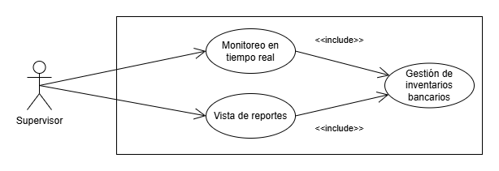

# Manual Tecnico - Proyecto - Grupo 7
# Money Bin

## 1. Antecedentes

## 2. Core del negocio
### Descripcion
### CDU de Alto nivel
### CDU Primera Descomposición

## 3. Requerimientos Funcionales
### 4. Módulo Supervisor
---
### RF-4.1 - Login de Supervisor
El supervisor del sistema debe poder hacer login al sistema y posteriormente validar su identidad por medio de una clave tipo `.pem`.

### RF-4.2 - Modificar información del empleado
El supervisor debe poder actualizar la información del empleados en caso de ser requerido. De igual forma, si el empleado requiere un cambio de contraseña, el administrador puede enviar una notificación con una nueva, siempre y cuando el empleado no haya solicitado una contraseña mas de 3 veces, de otra forma, el empleado será despedido.

### RF-4.3 - Aceptar Prestamo
El supervisor debe poder aceptar o rechazar las solicitudes de prestamos de los clientes, simpre y cuando el sistema valide que el cliente no tiene ninguna solicitud o prestamos pendiente.

### RF-4.4 - Revisar encuestas de satisfacción
El supervisor deberá poder revisar las encuestas de satisfacción que los clientes hubiesen respondido, para poder encontrar puntos de mejora.

### RF-4.5 - Ver registros de quejas
El supervisor deberá poder revisar todas la quejas que los usuarios hubiesen presentado sobre los servicios y así poder evaluar puntos de mejora.

### RF-4.6 - Registro de administradores
El supervisor deberá poder crear los usuarios de los administradores del sistemas, para dicha acción deberá poder completar y cargar toda la información necesaria. Posteriormente el sistema debe enviar al administrador un usuario de confirmación con su nuevo usuario y su contraseña, además el sistema debe implementar una autenticación de 2 factores para el usuario administrador.

### RF-4.7 - Ver información de los administradores del sistema
El supervisor deberá poder ver, editar o eliminar cualquier información de los usuarios administradores del sistema. De igual forma, el sistema debe notificar al usuario administrador sobre cualquier cambio realizado sobre su perfil.

### RF-4.8 - Monitoreo de actividad en tiempo real
El administrador deberá poder revisar en tiempo real ciertas activdades del sistema como por ejemplo, retiros, solicitudes de préstamos, bloque y activación de tarjetas, actividades realizadas por los administradores (registros de empleados, asignación de roles, eliminación de empleados, cambios de contraseñas de empleados). El supervisor deberá poder contar con filtros para los datos en tiempo real, además, el sistema deberá poder alertar al supervisor sobre posibles actividades anormales.

### RF-4.9 - Gestión de inventarios bancarios
El administrador deberá poder realizar gestiones sobre el efectivo y otros recursos de la sucursal. Además deberá poder visualizar las entradas y salidas de dinero en tiempo real. De igual forma, deberá poder ver reportes del dinero que posee el banco (dolares y quetzales), salidas y entrada de dinero con filtros, ganancias o pérdidas a lo largo del tiempo.

### RF-4.10 - Aprobación de tarjetas
El supervisor deberá poder aprobar o rechazar las solicitudes de tarjetas (credito, o debito) de los clientes. Par poder tomar la decisión deberá poder visualizar toda la información y record financiero del cliente.

### RF-4.11 - Aprobación de solicitudes de cancelación de servicios
El supervisor será el encargado de aprobar o rechazar las solicitudes de cancelación de servicios de los clientes. Previo a esto, debe validar que todo este en orden para proceder con la cancelación, de igual forma, si el sistema verifica que hay inconvenientes no debe permitir realizar la cancelación del servicio.

### RF-4.12 - Reportes
El supervisor deberá poder visualizar una serie de reportes que le facilitarán la toma de decisiones respecto al banco y sus actividades.

## 4. Requerimientos no funcionales
### 4. Módulo Supervisor
---
### RNF-4.1 - Seguridad de la autenticación del supervisor
El sistema debe proveer los métodos de seguridad necesarios para minimizar el riesgo a un posible ingreso no deseado al perfil del supervisor del sistema.

### RNF-4.2 - Rendimiento del módulo del supervisor
El sistema debe asegurar un rendimiento adecuado en el módulo del supervisor, permitiendole realizar las tareas con un tiempo de respuesta aceptable para una mejor experiencia del usuario.

### RNF-4.3 - Usabilidad y diseño de interfaz del modulo del supervisor
El sistema de asegurar una buena experiencia para el usuario tanto en usabilidad como en interfaz. Esto para asegurarnos que el usuario pueda comprender el uso del sistema de una manerar mucho más fácil y ágil.

### RNF-4.4 - Versatilidad en los reportes del supervisor
El sistema debe asegurar que el supervisor pueda tener versatilidad a la hora de ver sus reportes, logrando esto por medio de filtros y buenos tiempos de respuesta que aseguren una mejor toma de decisiones.

### RNF-4.5 - Disponibilidad en los reportes del supervisor
El sistema debe asegurar una buena disponibilidad en los reportes en tiempo real del supervisor, inclusive en los momentos de alta demanda del sistema.

## 5. CDU Expandidos
### 4. Módulo Supervisor
---
### DCDU-4.1 - Login del supervisor

### CDU-4.1: Login
**ID:** CDU-4.1
**Nombre:** Login
**Actor Principal:** Supervisor
**Propósito:** Permitir al supervisor iniciar sesión en el sistema de forma segura.  
**Resumen:** El supervisor podrá iniciar sesión utilizando sus credenciales registradas en el sistema.  

#### Flujo Principal
1. El supervisor abre la pantalla de inicio de sesión.
2. El sistema muestra los campos para ingresar:
   - Correo y contraseña, o
   - Nombre de usuario autoasignado y contraseña.
3. El supervisor ingresa las credenciales.
4. El sistema valida las credenciales.
5. Si las credenciales son válidas, el supervisor sigue al CDU-4.2.

#### Flujo Alternativo
- **Credenciales inválidas:**
  1. El sistema muestra un mensaje de error.
  2. El supervisor tiene la opción de reintentar.

- **Postcondición:** El supervisor accede al sistema o recibe un mensaje indicando que sus credenciales son incorrectas.  
---

### CDU-4.2: Verificar clave
**ID:** CDU-4.2
**Nombre:** Verificar clave
**Actor Principal:** Supervisor
**Propósito:** Permitir al supervisor cargar su archivo de claves `.ayd` para asegurar su identidad.  
**Resumen:** El supervisor podra cargar su archivo de claves `.ayd` para confirmar su identidad y tener mayor seguridad de su perfil.  

#### Flujo Principal
1. El supervisor cargar el archivo de claves `.ayd` en el espacio destinado.
2. El supervisor confirma la carga de archivos.
3. El sistema valida las credenciales.
5. Si las credenciales son válidas, el supervisor accede al sistema.

#### Flujo Alternativo
- **Credenciales inválidas:**
  1. El sistema muestra un mensaje de error.
  2. El supervisor tiene la opción de reintentar.

- **Postcondición:** El supervisor accede al sistema o recibe un mensaje indicando que sus credenciales son incorrectas.  
---

### DCDU-4.2 - Modificación de información del empleado

### CDU-4.3: Modificar información del empleado
**ID:** CDU-4.3
**Nombre:** Modificar información del empleado
**Actor Principal:** Supervisor
**Propósito:** Permitir al supervisor modificar la información de los empleados registrados en el sistema.  
**Resumen:** El supervisor podrá modificar, eliminar o agregar información de los empleados registrados en el sistema.  

#### Flujo Principal
1. El supervisor ingresa a la opción de 'Empleados'.
2. El supervisor identifica al empleado por medio del CUI y presiona el botón 'Editar'.
3. El supervisor podrá modificar el nombre, teléfono, correo, fotografía, genero y estado civil siempre y cuando estos datos contengan información.
5. El supervisor dará click en el botón 'Guardar'.

#### Flujo Alternativo
- **Reiniciar contraseña:**
    1. El supervisor ingresa a la opción de 'Empleados'.
    2. El supervisor identifica al empleado por medio del CUI y presiona el botón 'Editar'.
    3. El supervisor dará click en la opción 'Solicitar nueva contraseña'.

#### Excepciones
- **Datos incorrectos:**
    1. El sistema valida existen datos incorrectos.
    2. El sistema notifica al supervisor que debe corregir los datos incorrectos.

- **Postcondición:** En caso de realizar el flujo alterno de 'Reiniciar contraseña' se debe continuar con el CDU-4.4.  
---

### CDU-4.4: Reinicia contraseña de empleado
**ID:** CDU-4.4
**Nombre:** Reinicia contraseña de empleado
**Actor Principal:** Supervisor
**Propósito:** Permitir al supervisor solicitar al administrador del sistema el reinicio de la contraseña de un empleado.  
**Resumen:** El supervisor podrá solicitar al administrador del sistema que este le pueda reiniciar la contraseña a un empleado.

- **Precondición:** Haber realizado el flujo alterno del CDU-4.3.  

#### Flujo Principal
1. El sistema solicitará al supervisor una confirmación del reinicio de contraseña para el empleado.
2. El supervisor confirma el reinicio.

#### Flujo Alternativo
- **Cancelar:**
    1. El sistema solicitará al supervisor una confirmación del reinicio de contraseña para el empleado.
    2. El supervisor cancela el reinicio.
    3. El sistema redirigirá al supervisor a la pantalla de modificación de empleado.

- **Postcondición:** Realizar CDU-4.5.  
---

### CDU-4.5: Bloqueo de acceso a empleado
**ID:** CDU-4.5
**Nombre:** Bloqueo de acceso a empleado
**Actor Principal:** Sistema
**Propósito:** Validar que el empleado no tenga mas de 3 solicitudes de reinicio de contraseña.  
**Resumen:** El sistema deberá validar que el empleado no tenga mas de 3 solicitudes de reinicio de contraseña, de lo contrario se bloqueará el acceso al sistema.

- **Precondición:** Haber realizado el flujo principal del CDU-4.4.  

#### Flujo Principal
1. El sistema verifica que el empleado ha realizado mas de 3 solicitudes de reinicio de contraseña.
2. El sistema bloquea el acceso del empleado.

#### Flujo Alternativo
- **Envío de solicitud al administrador:**
    1. El sistema verifica que el empleado no ha realizado mas de 3 solicitudes de reinicio de contraseña.
    2. El sistema envía una solicitud de reinicio de contraseña del empleado al administrador.
---

### DCDU-4.3 - Aceptar o rechazar prestamo

### CDU-4.6: Aceptar o rechazar prestamo
**ID:** CDU-4.6
**Nombre:** Aceptar o rechazar prestamo
**Actor Principal:** Supervisor
**Propósito:** Permitir al supervisor aceptar o rechazar las solicitudes de préstamos.  
**Resumen:** El supervisor podrá revisar las solicitudes de prestamos válidad y aceptarlas o rechazarlas.

- **Precondición:** Haber realizado el CDU-4.7.  

#### Flujo Principal
1. El supervisor se dirige a la opción de 'Solicitudes de Préstamos'.
2. El supervisor identifica la solicitud de préstamo y selecciona la opción 'Ver información'
3. El sistema muestra la información relacionada a la solicitud de préstamo.
4. El supervisor selecciona la opción 'Aceptar'.

#### Flujo Alternativo
- **Rechazo de solicitud:**
    1. El supervisor se dirige a la opción de 'Solicitudes de Préstamos'.
    2. El supervisor identifica la solicitud de préstamo y selecciona la opción 'Ver información'
    3. El sistema muestra la información relacionada a la solicitud de préstamo.
    4. El supervisor selecciona la opción 'Rechazar'.
---

### CDU-4.7: Validar préstamo existente
**ID:** CDU-4.7
**Nombre:** Validar préstamo existente
**Actor Principal:** Sistema
**Propósito:** Permitir al sistema validar que el usuario no cuenta con préstamos existentes.  
**Resumen:** El sistema validará que el usuario no cuente con préstamos existentes.

#### Flujo Principal
1. El sistema valida que el usuario cuenta con préstamos existentes.
2. El sistema cancela la solicitud de préstamo e informa al usuario.

#### Flujo Alternativo
- **Ingreso de solicitud:**
    1. El sistema valida que el usuario no cuenta con préstamos existentes.
    2. El sistema registra la solicitud para revisión del supervisor.
---

### DCDU-4.4 - Revisar encuestas de satisfacción y registros de quejas

### CDU-4.8: Revisión de encuestas de satisfacción
**ID:** CDU-4.8
**Nombre:** Revisión de encuestas de satisfacción
**Actor Principal:** Supervisor
**Propósito:** Permitir al supervisor revisar las encuestas de satisfacción respondidas por los clientes.  
**Resumen:** El sistema permitirá al supervisor poder visualizar los resultados de las encuentras respondidas por los clientes.

#### Flujo Principal
1. El supervisor del sistema ingresa a la opción 'Encuestas de satisfacción'.
2. El sistema muestra al supervisor los resultados de las encuestas de satisfacción de los servicios.
---

### CDU-4.9: Ver registro de quejas
**ID:** CDU-4.9
**Nombre:** Ver registro de quejas
**Actor Principal:** Supervisor
**Propósito:** Permitir al supervisor ver los registros de quejas proporcionadas por los clientes.  
**Resumen:** El sistema permitirá al supervisor poder ver los registros de quejas ingresadas por los clientes.

#### Flujo Principal
1. El supervisor del sistema ingresa a la opción 'Registro de quejas'.
2. El sistema muestra al supervisor los resultados de los registros de quejas proporcionadas por los clientes.
---

### DCDU-4.5 - Registro y modificación de administradores del sistema

### CDU-4.10: Registro de administrador del sistema
**ID:** CDU-4.10
**Nombre:** Registro de administrador del sistema
**Actor Principal:** Supervisor
**Propósito:** Permitir al supervisor poder registrar administradores del sistema.  
**Resumen:** El supervisor podrá registrar nuevos usuarios administradores del sistema.  

#### Flujo Principal
1. El supervisor ingresa a la opción de 'Administradores'
2. El supervisor dará click en el botón 'Registrar'.
3. El sistema mostrará el formulario de información solicitada para el nuevo administrador.
4. El supervisor debe completar el formulario con los datos solicitados como nombre, telefono, edad, DPI, correo, papelería completa en pdf, fotografía, género y estado civil.
5. El supervisor confirma el registro.
6. El sistema envía un correo de confirmación al administrador con su nuevo usuario y una contraseña generada de forma automática que contiene 16 caractéres, incluyendo símbolos, letras y números.
7. El sistema habilita la autenticación de 2 factores para el nuevo usuario administrador.

#### Excepciones
- **Datos incorrectos:**
    1. El sistema valida existen datos incorrectos.
    2. El sistema notifica al supervisor que debe corregir los datos incorrectos.
---

### CDU-4.11: Modificación de administrador del sistema
**ID:** CDU-4.11
**Nombre:** Modificación de administrador del sistema
**Actor Principal:** Supervisor
**Propósito:** Permitir al supervisor poder modificar la información de los administradores del sistema.  
**Resumen:** El supervisor podrá modificar la información de los administradores del sistema.  

#### Flujo Principal
1. El supervisor ingresa a la opción de 'Administradores'
2. El supervisor identificará al administrador y dará click en la opción 'Editar'
3. El sistema mostrará la información del administrador.
4. El supervisor modifica o elimina la información del administrador.
5. El supervisor debe dar click en la opción 'Guardar'.
6. El sistema notifica por medio de correo electrónico al administrador los cambios realizados en su información.

#### Flujo Alternativo
- **Ver información:**
    1. El supervisor ingresa a la opción de 'Administradores'
    2. El supervisor identificará al administrador y dará click en la opción 'Ver'
    3. El sistema mostrará la información del administrador.
    5. El supervisor debe dar click en la opción 'Cerrar'.

#### Excepciones
- **Datos incorrectos:**
    1. El sistema valida existen datos incorrectos.
    2. El sistema notifica al supervisor que debe corregir los datos incorrectos.
---

### DCDU-4.6 - Gestión de inventarios, monitoreo en tiempo real y reportes

### CDU-4.12: Monitoreo en tiempo real
**ID:** CDU-4.12
**Nombre:** Monitoreo en tiempo real
**Actor Principal:** Supervisor
**Propósito:** Permitir al supervisor realizar un monitoreo en tiempo real de las actividades en el sistema.  
**Resumen:** El supervisor podrá monitorear en tiempo real las actividades que se estén realizando dentro del sistema.  

#### Flujo Principal
1. El supervisor ingresa a la opción de 'Monitoreo'.
2. El sistema mostrará un dashboard con los datos en tiempo real del sistema como transacciones, usuarios, empleados, cuentas, etc.
---

### CDU-4.13: Vista de Reportes
**ID:** CDU-4.13
**Nombre:** Vista de Reportes
**Actor Principal:** Supervisor
**Propósito:** Permitir al supervisor poder visualizar los reportes del sistema.  
**Resumen:** El supervisor podrá visualizar los reportes del sistema.  

#### Flujo Principal
1. El supervisor ingresa a la opción de 'Reportes'.
2. El sistema mostrará los reportes disponibles del sistema.
3. El supervisor identificara el reporte requerido y dara click en la opción 'Generar'
4. El supervisor debe ingresar los parámetros requeridos en caso de haberlo.
5. El sistema mostrará el reporte solicitado por el usuario.
---

### CDU-4.14: Gestión de inventarios bancarios
**ID:** CDU-4.14
**Nombre:** Gestión de inventarios bancarios
**Actor Principal:** Supervisor
**Propósito:** Permitir al supervisor poder gestionar el efectivo y otros recursos de la sucursal.  
**Resumen:** El supervisor podrá gestionar el efectivo y otros recursos de la sucursal.  

#### Flujo Principal
1. El supervisor ingresa a la opción de 'Gestión de Inventario Bancario'
2. El sistema le mostrará al usuario la información actual de los recursos de la sucursal.
3. El supervisor puede modificar los recursos de la sucursal.
4. El supervisor debe seleccionar el botón 'Guardar'.

#### Flujo Alternativo
- **Ver información:**
    1. El supervisor ingresa a la opción de 'Gestión de Inventario Bancario'
    2. El sistema le mostrará al usuario la información actual de los recursos de la sucursal.
    4. El supervisor debe seleccionar el botón 'Cerrar'.

#### Excepciones
- **Datos incorrectos:**
    1. El sistema valida existen datos incorrectos.
    2. El sistema notifica al supervisor que debe corregir los datos incorrectos.
---

### DCDU-4.7 - Aprobar tarjetas y cancelación de servicios

### CDU-4.15: Aprobar o rechazar tarjeta
**ID:** CDU-4.15
**Nombre:** Aprobar o rechazar tarjeta
**Actor Principal:** Supervisor
**Propósito:** Permitir al supervisor poder aprobar o rechazar las solicitudes de tarjetas de los clientes.  
**Resumen:** El supervisor podrá aprobar o rechazar las solicitudes de tarjetas ingresadas por los clientes.  

#### Flujo Principal
1. El supervisor ingresa a la opción de 'Solicitudes de Tarjetas'.
2. El sistema mostrará las solicitudes en el sistema.
3. El supervisor identificará la solicitud y seleccionará la opción 'Revisar'.
4. El sistema mostrará al supervisor toda la información relacionada a la solicitud.
5. El supervisor seleccionará el botón 'Aceptar'.
6. El sistema registrará la información de la nueva tarjeta.

#### Flujo Alternativo
- **Rechazar solicitud:**
    1. El supervisor ingresa a la opción de 'Solicitudes de Tarjetas'.
    2. El sistema mostrará las solicitudes en el sistema.
    3. El supervisor identificará la solicitud y seleccionará la opción 'Revisar'.
    4. El sistema mostrará al supervisor toda la información relacionada a la solicitud.
    5. El supervisor seleccionará el botón 'Rechazar'.
---

### CDU-4.16: Cancelar servicio
**ID:** CDU-4.16
**Nombre:** Cancelar servicio
**Actor Principal:** Supervisor
**Propósito:** Permitir al supervisor poder aprobar o rechazar las solicitudes de cancelación de servicios de los clientes.  
**Resumen:** El supervisor podrá aprobar o rechazar las solicitudes de cancelación de servicios ingresadas por los clientes.  

#### Flujo Principal
1. El supervisor ingresa a la opción de 'Cancelación de Servicios'.
2. El sistema mostrará las solicitudes en el sistema.
3. El supervisor identificará la solicitud y seleccionará la opción 'Revisar'.
4. El sistema mostrará al supervisor toda la información relacionada a la solicitud.
5. El supervisor seleccionará el botón 'Aceptar'.

#### Flujo Alternativo
- **Rechazar solicitud:**
    1. El supervisor ingresa a la opción de 'Cancelación de servicios'.
    2. El sistema mostrará las solicitudes en el sistema.
    3. El supervisor identificará la solicitud y seleccionará la opción 'Revisar'.
    4. El sistema mostrará al supervisor toda la información relacionada a la solicitud.
    5. El supervisor seleccionará el botón 'Rechazar'.

- **Postcondición:** En caso de realizar el flujo principal, continuar con el CDU-4.17
---

### CDU-4.17: Verificar inconvenientes del servicio
**ID:** CDU-4.17
**Nombre:** Verificar inconvenientes del servicio
**Actor Principal:** Sistema
**Actor Secundario:** Supervisor
**Propósito:** Validar que el sistema a cancelar no cuente con ningún inconveniente.  
**Resumen:** El sistema validará que el sistema que se está cancelando no cuente con ningún inconveniente.  

- **Precondición:** Haber realizado el flujo principal del CDU-4.16

#### Flujo Principal
1. El sistema verificará que el servicio no cuenta con inconvenientes.
2. El sistema cancelará el servicio en cuestión.

#### Flujo Alternativo
- **Servicio con inconvenientes:**
    1. El sistema verificará que el servicio cuenta con inconvenientes.
    2. El sistema notificará al supervisor de que el servicio no puede ser cancelado y mostrará los inconvenientes relacionados.
---

## 6. Matrices de Trazabilidad
### Stakeholders vrs Requerimientos
### Stakeholders vrs CDU
### Requerimientos vrs CDU

## 7. Diagramas
### Diagrama de Componentes
### Diagrama de Despliegue

## 8. Diagrama Entidad Relación

## 9. Prototipos
### 4. Módulo Supervisor
### PTPO-4.1 - Login

### PTPO-4.2 - Validar Clave

### PTPO-4.3 - Menú Supervisor

### PTPO-4.4 - Catálogos

### PTPO-4.5 - Formularios

### PTPO-4.6 - Monitor

### PTPO-4.7 - Reportes

## 10. Patrones de Diseño
### Patron de Diseño Command
El Patrón de Diseño Command es uno de los patrones de comportamiento que permite encapsular una solicitud como un objeto, lo que te permite parametrizar a los clientes con diferentes solicitudes, hacer cola o registrar las solicitudes, y soportar la deshacer operaciones. Es útil para desacoplar los emisores de las solicitudes de los objetos que las ejecutan.

La idea central del patrón Command es que, en lugar de ejecutar una acción directamente, se crea un objeto de comando que encapsula toda la información necesaria para llevar a cabo una acción o invocar un método específico en un objeto receptor. Este patrón es muy útil cuando las operaciones o solicitudes que un sistema debe realizar son complejas, deben ser deshechas o incluso almacenadas para ser ejecutadas más tarde.

#### Ventajas del Patrón Command
 
1. **Desacoplamiento**: 
Permite desacoplar el objeto que invoca la operación del objeto que la realiza. Esto facilita la extensión del sistema, ya que puedes agregar nuevos comandos sin modificar las clases existentes.

2. **Deshacer/Rehacer**: 
Implementar la funcionalidad de deshacer/rehacer es más fácil. Como los comandos son objetos, puedes almacenarlos y ejecutarlos en un orden inverso para deshacer las acciones.

3. **Simplicidad en la ejecución**: 
Puede transformar un conjunto de acciones complejas en una simple interfaz que permite que se ejecuten acciones con solo hacer una llamada de función.

4. **Registro y secuenciación de acciones**: 
Puedes almacenar y ejecutar una secuencia de comandos. También puedes hacer una cola de comandos y ejecutarlos de forma asíncrona.

Dado todo lo anterior, hemos optado por este patron de diseño ya que nos será de mucha utilidad para la ejecución de las operaciones transaccionales del sistema como retiros, pagos, depósitos, etc. Incluso nos puede ser de gran ayuda con el manejo de solicitudes de clientes, como lo son las solicitudes de cancelación de servicios, la solicitudes de tarjetas, solicitudes de restablecimiento de contraseña, etc.

## 11. Tablero Kanban