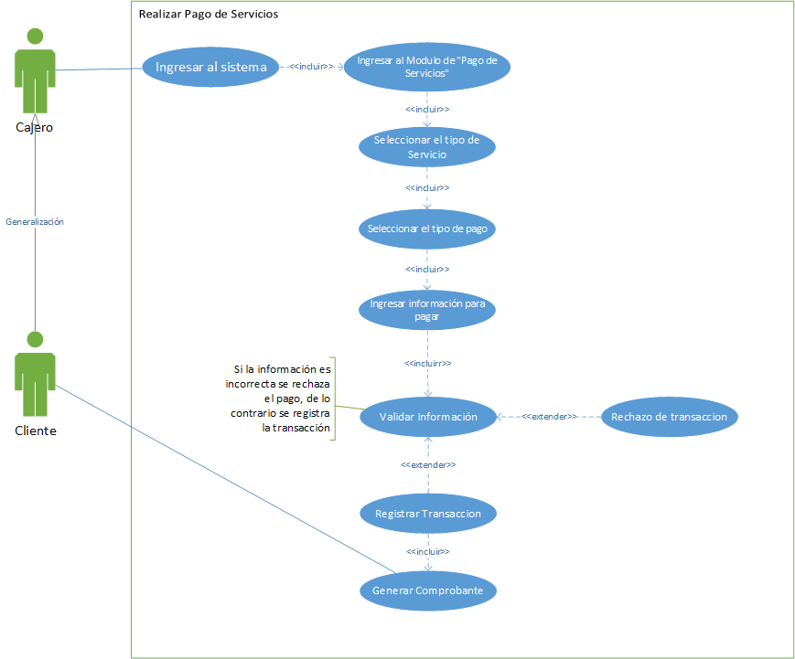
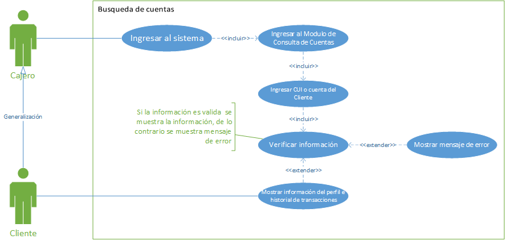
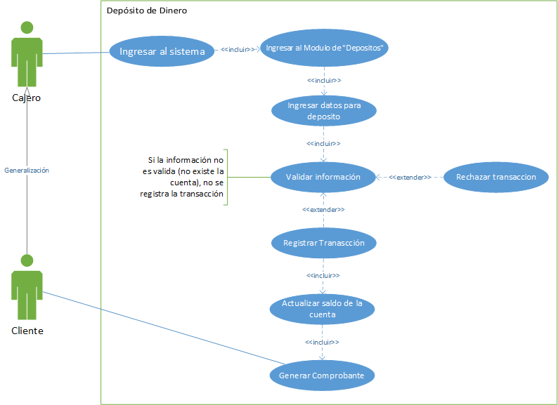
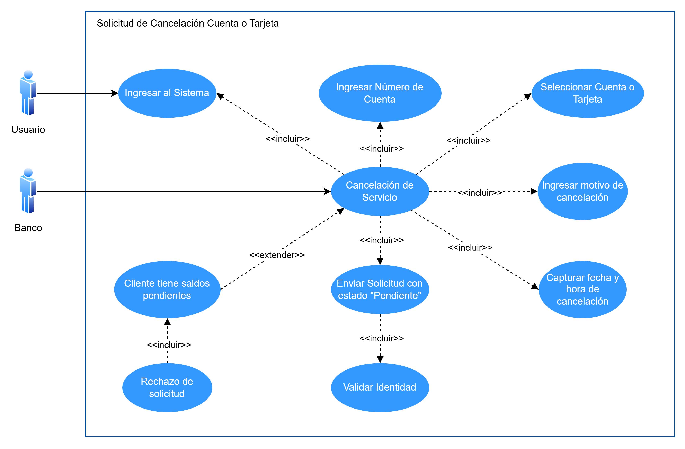

# Manual Tecnico - Proyecto - Grupo 7

## ANTECEDENTES

## CORE DEL NEGOCIO

### DESCRIPCIÓM

### CDU ALTO NIVEL

#### Primera Descomposición

#### 1. ROL CAJERO

##### DCDU-1.1 Login

##### DCDU-1.2 Pago de Servicios

##### DCDU-1.3 Pago de Prestamos

##### DCDU-1.4 Busqueda Clientes

##### DCDU-1.5 Consulta de Saldo

##### DCDU-1.6 Cambio de Moneda

##### DCDU-1.7 Retiros

##### DCDU-1.8 Depositos

##### DCDU-1.9 Pago Tarjeta

#### 2. ROL SERVICIO AL CLIENTE
##### DCDU-2.1 Creacion de Cuenta Bancaria Normal y en Dólares

##### DCDU-2.2 Actualización de Datos del Cliente

##### DCDU-2.3 Creación de Tarjetas de Crédito o Débito

##### DCDU-2.4 Bloqueo de Tarjetas de Crédito o Débito

##### DCDU-2.5 Solicitud de Cancelación de Cuenta o Tarjeta

##### DCDU-2.6 Encuesta de Satisfacción

##### DCDU-2.7 Solicitud de Préstamo

##### DCDU-2.8 Registro de Quejas

#### 4. ROL SUPERVISOR

### DCDU-4.1 - Login del supervisor

### DCDU-4.2 - Modificación de información del empleado

### DCDU-4.3 - Aceptar o rechazar prestamo

### DCDU-4.4 - Revisar encuestas de satisfacción y registros de quejas

### DCDU-4.5 - Registro y modificación de administradores del sistema

### DCDU-4.6 - Gestión de inventarios, monitoreo en tiempo real y reportes

### DCDU-4.7 - Aprobar tarjetas y cancelación de servicios

#### ROL ADMON SISTEMAS

## REQUERIMIENTOS FUNCIONALES

### 1. MÓDULO CAJERO  

#### RF-1.1. Gestión de Acceso: Login

- El sistema debe permitir al cajero iniciar sesión utilizando:
  - Correo y contraseña registrados.
  - Nombre de usuario autoasignado.
- Validación de credenciales para garantizar la seguridad del acceso.

#### RF-1.2. Pago de Servicios

- El sistema debe permitir al cajero registrar pagos de servicios básicos como agua, luz, teléfono e internet.
- **Para pagos en efectivo**, debe solicitar:
  - Nombre del titular del servicio.
  - Código de servicio.
  - Monto a pagar.
- **Para pagos desde una cuenta bancaria**, debe solicitar:
  - Nombre del titular del servicio.
  - Código de servicio.
  - Monto a pagar.
  - Número de cuenta.
  - DPI del titular de la cuenta.
- Validar que la persona que realiza el pago sea el titular de la cuenta bancaria.

#### RF-1.3. Pago de Préstamos

- Registrar pagos parciales o totales de préstamos adquiridos.
- Solicitar:
  - Número de cuenta.
  - Número de préstamo.
  - Monto a pagar.
  - Fecha del pago.
- Actualizar el saldo del préstamo correspondiente.

#### RF-1.4. Búsqueda de Clientes

- Permitir la búsqueda de clientes por número de cuenta o CUI.
- Mostrar:
  - Perfil del cliente.
  - Detalles de contacto.
  - Historial de transacciones.

#### RF-1.5. Consulta de Saldo

- Mostrar el saldo actual disponible de una cuenta.
- Incluir la fecha y hora de la última actualización.

#### RF-1.6. Cambio de Moneda

- Permitir el cambio de quetzales a dólares bajo las siguientes restricciones:
  - Límite de Q 10,000.00 por día.
  - Solo puede realizarse una vez al mes.

#### RF-1.7. Generación de Comprobantes

- Generar un comprobante en PDF para cada transacción con la siguiente información:
  - Número de cuenta (si aplica).
  - Tipo de transacción.
  - Fecha y hora.
  - Monto.
  - Nombre y firma digital del cajero autorizado.

#### RF-1.8. Retiro de Dinero

- Registrar retiros de efectivo desde cuentas bancarias.
- Solicitar:
  - Número de cuenta.
  - Monto a retirar.
  - Fecha y hora del retiro.
  - Tipo de cuenta (monetaria o de ahorro).
  - Moneda del retiro (quetzales o dólares).
- Implementar límites de retiro y validaciones de identidad.

#### RF-1.9. Depósito de Dinero

- Registrar depósitos en cuentas bancarias.
- Solicitar:
  - Número de cuenta.
  - Monto a depositar.
  - Fecha y hora del depósito.
  - Tipo de cuenta (monetaria o de ahorro).
  - Moneda del depósito (quetzales o dólares).
- Validar que el módulo de depósitos en dólares esté activado.

#### RF-1.10. Pago de Tarjetas de Crédito

- Registrar pagos de tarjetas de crédito.
- Calcular los cargos mensuales de Q 75.00 y los intereses simples del 5% en caso de atrasos.

### 2. MÓDULO ATENCIÓN AL CLIENTE  

#### RF-2.1. Creación de Cuenta Bancaria Normal y en Dólares

- El empleado del banco encargado de la atención al cliente debe tener un módulo específico para crear nuevas cuentas bancarias en el sistema.
- Las cuentas pueden ser de dos tipos distintos:
  - Con tipo de moneda de cambio local.
  - Con tipo de moneda de cambio en dólares.
- Debe ingresarse los datos del cliente vinculado, seleccionar si la cuenta es monetaria o de ahorro y el monto inicial.
- Debe hacerse una validación de identidad para completar el proceso.

#### RF-2.2. Actualización de Datos del Cliente

- Debe haber un módulo para el encargado de atención al cliente para actualizar datos de los clientes.
- Debe verificarse la identidad del cliente respondiendo la pregunta de seguridad registrada durante la creación de la cuenta bancaria.
- Al completar el proceso debe guardarse en el historial los cambios realizados incluyendo la fecha y hora.

#### RF-2.3. Creación de Tarjetas de Crédito o Débito

- Debe ser posible para el encargado de atención al cliente crear nuevas tarjetas de crédito o débito.
- Para completar el proceso debe enviarse la solicitud con estado pendiente al supervisor para que pueda aprobarla o rechazarla.
- Antes de enviar la solicitud debe realizarse una verificación de identidad.

#### RF-2.4. Bloqueo de Tarjetas de Crédito o Débito

- Debe existir un módulo para que el encargado de atención al cliente pueda realizar bloqueos a tarjetas de crédito o débito por cualquiera de los motivos siguientes:
  - Robo.
  - Pérdida.
  - Fraude.
- Para completar el proceso debe notificarse al titular de la tarjeta del bloqueo exitoso y generar un reporte al equipo correspondiente para el análisis de fraude, en caso de ser necesario.

#### RF-2.5. Solicitud de Cancelación de Cuenta o Tarjeta

- El empleado encargado de atención al cliente debe poder emitir solicitudes de cancelación de cuentas o tarjetas de crédito o débito.
- Debe enviarse la solicitud con estado pendiente al supervisor para que pueda aprobarla o rechazarla.
- Para completar el proceso es necesario que el supervisor examine el perfil del cliente para tomar la decisión de la solicitud.

#### RF-2.6. Encuesta de Satisfacción

- Los clientes pueden evaluar la atención al cliente, servicios, productos, etc., mediante una encuesta.
- Al finalizar la encuesta se debe puntuar el área evaluada.
- Completada la encuesta, los datos se guardan para posteriormente realizar análisis.

#### RF-2.7. Solicitud de Préstamo

- El sistema debe tener un módulo de solicitud de préstamos que permite a los encargados de atención al cliente gestionar préstamos para los clientes.
- Es necesario ingresar datos como número de cuenta y monto solicitado.
- También se debe seleccionar el tipo de préstamo y el plazo en que se pagará el préstamo.
- Los clientes deberán cargar documentación requerida en PDF, y la autorización final recae en el supervisor.
- El sistema debe realizar un análisis automático de la capacidad de pago del cliente, verificando si no tiene alguna deuda actual.
- Deben establecerse tasas de interés dinámicas basadas en el historial crediticio del cliente y el tipo de préstamo.
- Las solicitudes rechazadas deben incluir una justificación clara y recomendaciones para el cliente.

#### RF-2.8. Registro de Quejas

- Debe permitirse registrar quejas hechas por los clientes.
- Debe registrarse los detalles de la queja, los datos importantes del cliente como su número de cuenta, etc., y el servicio del que se va a presentar la queja.
- Al completarse el registro de la queja se envía automáticamente un correo electrónico al supervisor para notificar sobre el incidente.

### 4. Módulo Supervisor

#### RF-4.1 - Login de Supervisor
El supervisor del sistema debe poder hacer login al sistema y posteriormente validar su identidad por medio de una clave tipo `.pem`.

#### RF-4.2 - Modificar información del empleado
El supervisor debe poder actualizar la información del empleados en caso de ser requerido. De igual forma, si el empleado requiere un cambio de contraseña, el administrador puede enviar una notificación con una nueva, siempre y cuando el empleado no haya solicitado una contraseña mas de 3 veces, de otra forma, el empleado será despedido.

#### RF-4.3 - Aceptar Prestamo
El supervisor debe poder aceptar o rechazar las solicitudes de prestamos de los clientes, simpre y cuando el sistema valide que el cliente no tiene ninguna solicitud o prestamos pendiente.

#### RF-4.4 - Revisar encuestas de satisfacción
El supervisor deberá poder revisar las encuestas de satisfacción que los clientes hubiesen respondido, para poder encontrar puntos de mejora.

#### RF-4.5 - Ver registros de quejas
El supervisor deberá poder revisar todas la quejas que los usuarios hubiesen presentado sobre los servicios y así poder evaluar puntos de mejora.

#### RF-4.6 - Registro de administradores
El supervisor deberá poder crear los usuarios de los administradores del sistemas, para dicha acción deberá poder completar y cargar toda la información necesaria. Posteriormente el sistema debe enviar al administrador un usuario de confirmación con su nuevo usuario y su contraseña, además el sistema debe implementar una autenticación de 2 factores para el usuario administrador.

#### RF-4.7 - Ver información de los administradores del sistema
El supervisor deberá poder ver, editar o eliminar cualquier información de los usuarios administradores del sistema. De igual forma, el sistema debe notificar al usuario administrador sobre cualquier cambio realizado sobre su perfil.

#### RF-4.8 - Monitoreo de actividad en tiempo real
El administrador deberá poder revisar en tiempo real ciertas activdades del sistema como por ejemplo, retiros, solicitudes de préstamos, bloque y activación de tarjetas, actividades realizadas por los administradores (registros de empleados, asignación de roles, eliminación de empleados, cambios de contraseñas de empleados). El supervisor deberá poder contar con filtros para los datos en tiempo real, además, el sistema deberá poder alertar al supervisor sobre posibles actividades anormales.

#### RF-4.9 - Gestión de inventarios bancarios
El administrador deberá poder realizar gestiones sobre el efectivo y otros recursos de la sucursal. Además deberá poder visualizar las entradas y salidas de dinero en tiempo real. De igual forma, deberá poder ver reportes del dinero que posee el banco (dolares y quetzales), salidas y entrada de dinero con filtros, ganancias o pérdidas a lo largo del tiempo.

#### RF-4.10 - Aprobación de tarjetas
El supervisor deberá poder aprobar o rechazar las solicitudes de tarjetas (credito, o debito) de los clientes. Par poder tomar la decisión deberá poder visualizar toda la información y record financiero del cliente.

#### RF-4.11 - Aprobación de solicitudes de cancelación de servicios
El supervisor será el encargado de aprobar o rechazar las solicitudes de cancelación de servicios de los clientes. Previo a esto, debe validar que todo este en orden para proceder con la cancelación, de igual forma, si el sistema verifica que hay inconvenientes no debe permitir realizar la cancelación del servicio.

#### RF-4.12 - Reportes
El supervisor deberá poder visualizar una serie de reportes que le facilitarán la toma de decisiones respecto al banco y sus actividades.

---

## REQUERIMIENTOS NO FUNCIONALES

### RN-01. Rendimiento

- El sistema debe procesar transacciones en tiempo real con un tiempo de respuesta máximo de 2 segundos por operación.

### RN-02. Seguridad

- Todas las transacciones deben estar cifradas.
- Validación estricta de identidad para prevenir fraudes en retiros, pagos y depósitos.

### RN-03. Disponibilidad

- El sistema debe estar disponible al 99.9% del tiempo para garantizar la continuidad operativa en horario laboral.

### RN-04. Usabilidad

- La interfaz debe ser intuitiva y permitir la navegación rápida entre módulos.
- Proporcionar mensajes claros de error y confirmación para cada operación.

### RN-05. Escalabilidad

- El sistema debe ser capaz de manejar un crecimiento en el número de usuarios y transacciones sin afectar el rendimiento.

### RN-06. Compatibilidad

- El sistema debe ser compatible con los navegadores modernos y dispositivos utilizados por los cajeros.

### RN-07. Mantenibilidad

- El sistema debe estar diseñado con una arquitectura modular que facilite futuras actualizaciones y mantenimiento.

### RN-08. Conformidad Legal

- El sistema debe cumplir con las regulaciones locales e internacionales aplicables al manejo de datos bancarios y transacciones financieras.

### RN-09. Auditoría y Registro
Todas las acciones realizadas en el sistema deben registrarse en un historial con detalles como fecha, hora, usuario y acción realizada.

### RN-10 - Seguridad de la autenticación del supervisor
El sistema debe proveer los métodos de seguridad necesarios para minimizar el riesgo a un posible ingreso no deseado al perfil del supervisor del sistema.

### RN-11 - Versatilidad en los reportes del supervisor
El sistema debe asegurar que el supervisor pueda tener versatilidad a la hora de ver sus reportes, logrando esto por medio de filtros y buenos tiempos de respuesta que aseguren una mejor toma de decisiones.

### RN-12 - Disponibilidad en los reportes del supervisor
El sistema debe asegurar una buena disponibilidad en los reportes en tiempo real del supervisor, inclusive en los momentos de alta demanda del sistema.

## CDU EXPANDIDOS

### 1. MÓDULO CAJERO

#### CDU-1.1: Gestión de Acceso (Login)

**ID:** CDU-1.1  
**Nombre:** Gestión de Acceso  
**Actor Principal:** Cajero bancario  
**Propósito:** Permitir al cajero iniciar sesión en el sistema de forma segura.  
**Resumen:** El cajero podrá iniciar sesión utilizando sus credenciales registradas en el sistema.  

#### Flujo Principal

1. El cajero abre la pantalla de inicio de sesión.
2. El sistema muestra los campos para ingresar:
   - Correo y contraseña, o
   - Nombre de usuario autoasignado y contraseña.
3. El cajero ingresa las credenciales.
4. El sistema valida las credenciales.
5. Si las credenciales son válidas, el cajero accede a la plataforma.

#### Flujo Alternativo

- **Credenciales inválidas:**
  1. El sistema muestra un mensaje de error.
  2. El cajero tiene la opción de reintentar.

**Postcondición:** El cajero accede al sistema o recibe un mensaje indicando que sus credenciales son incorrectas.  

---

#### CDU-1.2: Pago de Servicios

**ID:** CDU-1.2  
**Nombre:** Pago de Servicios  
**Actor Principal:** Cajero bancario  
**Propósito:** Registrar pagos de servicios básicos en el sistema.  
**Resumen:** El cajero podrá procesar pagos de servicios básicos como agua, luz, teléfono e internet.

#### Flujo Principal (Pagos en Efectivo)

1. El cajero selecciona el módulo de "Pago de Servicios".
2. El sistema muestra el formulario de pago.
3. El cajero ingresa los siguientes datos:
   - Nombre del titular del servicio.
   - Código del servicio.
   - Monto a pagar.
4. El sistema valida los datos y registra el pago.
5. El sistema genera un comprobante en PDF.

#### Flujo Principal (Pagos desde Cuenta Bancaria)

1. El cajero selecciona el módulo de "Pago de Servicios".
2. El sistema muestra el formulario de pago desde cuenta bancaria.
3. El cajero ingresa los siguientes datos:
   - Nombre del titular del servicio.
   - Código del servicio.
   - Monto a pagar.
   - Número de cuenta.
   - DPI del titular de la cuenta.
4. El sistema valida que la cuenta y el DPI coincidan con el titular.
5. Si es válido, el sistema registra el pago y genera un comprobante.

#### Flujo Alternativo  

- **Datos inválidos:**  
  1. El sistema muestra un mensaje de error y solicita corregir la información.  

**Postcondición:** El pago queda registrado y el cliente recibe el comprobante correspondiente.  

---

#### CDU-1.3: Pago de Préstamos

**ID:** CDU-1.3  
**Nombre:** Pago de Préstamos  
**Actor Principal:** Cajero bancario  
**Propósito:** Registrar pagos de préstamos adquiridos por los clientes.  
**Resumen:** El cajero puede procesar pagos parciales o totales de préstamos.  

#### Flujo Principal

1. El cajero selecciona el módulo de "Pago de Préstamos".
2. El sistema muestra el formulario de pago.
3. El cajero ingresa los siguientes datos:
   - Número de cuenta.
   - Número de préstamo.
   - Monto a pagar.
   - Fecha del pago.
4. El sistema valida los datos.
5. Si los datos son válidos, el sistema registra el pago y actualiza el saldo del préstamo.
6. El sistema genera un comprobante en PDF.

#### Flujo Alternativo

- **Datos inválidos:**  
  1. El sistema muestra un mensaje de error y permite reintentar.  

**Postcondición:** El pago del préstamo queda registrado correctamente.  

---

#### CDU-1.4: Búsqueda de Clientes

**ID:** CDU-1.4  
**Nombre:** Búsqueda de Clientes  
**Actor Principal:** Cajero bancario  
**Propósito:** Permitir la búsqueda de clientes mediante número de cuenta o CUI.  
**Resumen:** El cajero puede localizar la información de un cliente de manera rápida y precisa.  

#### Flujo Principal

1. El cajero selecciona el módulo de "Búsqueda de Clientes".
2. El sistema solicita el número de cuenta o CUI.
3. El cajero ingresa el dato de búsqueda.
4. El sistema busca en la base de datos y muestra:
   - Perfil del cliente.
   - Detalles de contacto.
   - Historial de transacciones.

#### Flujo Alternativo

- **Cliente no encontrado:**  
  1. El sistema muestra un mensaje indicando que no hay coincidencias.  

**Postcondición:** El cajero accede a la información del cliente o recibe un mensaje de error.  

---

#### CDU-1.5: Consulta de Saldo

**ID:** CDU-1.5  
**Nombre:** Consulta de Saldo  
**Actor Principal:** Cajero bancario y cliente  
**Propósito:** Mostrar el saldo actual disponible en una cuenta.  
**Resumen:** El cajero puede consultar el saldo de una cuenta bancaria en nombre del cliente.  

#### Flujo Principal

1. El cajero selecciona el módulo de "Consulta de Saldo".
2. El sistema solicita el número de cuenta del cliente.
3. El cajero ingresa el número de cuenta.
4. El sistema muestra:
   - Saldo actual.
   - Fecha y hora de la última actualización.

#### Flujo Alternativo

- **Número de cuenta inválido:**  
  1. El sistema muestra un mensaje de error.  

**Postcondición:** El sistema muestra el saldo de la cuenta o un mensaje de error.  

---

#### CDU-1.6: Cambio de Moneda

**ID:** CDU-1.6  
**Nombre:** Cambio de Moneda  
**Actor Principal:** Cajero bancario  
**Propósito:** Permitir al cliente realizar el cambio de quetzales a dólares.  
**Resumen:** El cajero procesa el cambio de moneda bajo las restricciones definidas.  

#### Flujo Principal

1. El cajero selecciona el módulo de "Cambio de Moneda".
2. El sistema solicita los datos de la cuenta del cliente.
3. El cajero ingresa:
   - Número de cuenta.
   - Monto a cambiar.
4. El sistema valida que:
   - El monto no exceda Q 10,000.00.
   - El cliente no haya realizado un cambio este mes.
5. Si es válido, el sistema realiza el cambio y actualiza el saldo de la cuenta.

#### Flujo Alternativo

- **Restricciones no cumplidas:**  
  1. El sistema muestra un mensaje de error.  

**Postcondición:** El cambio de moneda queda registrado correctamente.  

---

#### CDU-1.7: Generación de Comprobantes

**ID:** CDU-1.7  
**Nombre:** Generación de Comprobantes  
**Actor Principal:** Sistema bancario  
**Propósito:** Generar un comprobante en PDF para cada transacción.  
**Resumen:** El sistema genera comprobantes de las operaciones realizadas.  

#### Flujo Principal

1. Al finalizar cualquier transacción, el sistema recopila los datos necesarios:
   - Número de cuenta (si aplica).
   - Tipo de transacción.
   - Fecha y hora.
   - Monto.
   - Nombre y firma digital del cajero autorizado.
2. El sistema genera un comprobante en PDF y lo envía al cliente.

**Postcondición:** El cliente recibe un comprobante válido de la transacción.  

---

#### CDU-1.8: Retiro de Dinero

**ID:** CDU-1.8  
**Nombre:** Retiro de Dinero  
**Actor Principal:** Cajero bancario  
**Propósito:** Registrar retiros de efectivo realizados por clientes.  
**Resumen:** El cajero puede procesar retiros de efectivo desde cuentas bancarias bajo las validaciones de identidad y límites establecidos.  

#### Flujo Principal

1. El cajero selecciona el módulo de "Retiro de Dinero".
2. El sistema solicita los datos del retiro.
3. El cajero ingresa:
   - Número de cuenta.
   - Monto a retirar.
   - Fecha y hora.
   - Tipo de cuenta (monetaria o de ahorro).
   - Moneda (quetzales o dólares).
4. El sistema valida que:
   - El monto no exceda los límites establecidos.
   - El cliente sea el titular de la cuenta.
5. Si los datos son válidos, el sistema registra el retiro.
6. El sistema genera un comprobante en PDF.

#### Flujo Alternativo

- **Datos inválidos o límites excedidos:**  
  1. El sistema muestra un mensaje de error e indica la causa.

**Postcondición:** El retiro queda registrado y se entrega el efectivo al cliente.  

---

#### CDU-1.9: Depósito de Dinero

**ID:** CDU-1.9  
**Nombre:** Depósito de Dinero  
**Actor Principal:** Cajero bancario  
**Propósito:** Registrar depósitos realizados por clientes en sus cuentas bancarias.  
**Resumen:** El cajero puede procesar depósitos, actualizando el saldo de la cuenta en tiempo real.  

#### Flujo Principal

1. El cajero selecciona el módulo de "Depósito de Dinero".
2. El sistema solicita los datos del depósito.
3. El cajero ingresa:
   - Número de cuenta.
   - Monto a depositar.
   - Fecha y hora del depósito.
   - Tipo de cuenta (monetaria o de ahorro).
   - Moneda (quetzales o dólares).
4. El sistema valida que:
   - El cliente tenga habilitado el módulo de depósitos en dólares (si aplica).
5. Si los datos son válidos, el sistema registra el depósito y actualiza el saldo de la cuenta.
6. El sistema genera un comprobante en PDF.

#### Flujo Alternativo

- **Datos inválidos o módulo deshabilitado:**  
  1. El sistema muestra un mensaje de error y detalla el motivo.

**Postcondición:** El depósito queda registrado correctamente en el sistema.  

---

#### CDU-1.10: Pago de Tarjetas de Crédito

**ID:** CDU-1.10  
**Nombre:** Pago de Tarjetas de Crédito  
**Actor Principal:** Cajero bancario  
**Propósito:** Registrar pagos de tarjetas de crédito realizadas por los clientes.  
**Resumen:** El cajero puede procesar pagos de tarjetas de crédito, incluyendo el cálculo de cargos y posibles intereses.  

#### Flujo Principal

1. El cajero selecciona el módulo de "Pago de Tarjetas de Crédito".
2. El sistema solicita los datos del pago.
3. El cajero ingresa:
   - Número de tarjeta de crédito.
   - Monto a pagar.
   - Fecha del pago.
4. El sistema calcula:
   - Cargo mensual de Q 75.00.
   - Intereses simples del 5% si el pago está atrasado.
5. El sistema valida los datos y registra el pago.
6. El sistema actualiza el saldo de la tarjeta y genera un comprobante en PDF.

#### Flujo Alternativo

- **Datos inválidos o inconsistencias:**  
  1. El sistema muestra un mensaje de error.

**Postcondición:** El pago de la tarjeta queda registrado correctamente en el sistema.  

---

### 2. MÓDULO SERVICIO AL CLIENTE

##### CDU-2.1: Creación de Cuenta Bancaria Normal y en Dólares
*ID:* CDU-2.1  
*Nombre:* Creación de Cuenta Bancaria Normal y en Dólares  
*Actor Principal:* Empleado de Atención al Cliente  
*Propósito:* Abrir una nueva cuenta monetaria o de ahorro con toda la información necesaria y garantizar su validación y seguridad.  
*Resumen:* El encargado de atención al cliente podrá completar un formulario con datos personales del cliente, seleccionar el tipo de cuenta y proporcionar un monto inicial. El sistema valida la información, genera un número de cuenta único y almacena los datos en la base de datos.  

##### Flujo Principal
1. El empleado accede al módulo de creación de cuentas.
2. Completa el formulario con la información requerida (nombre, apellido, CUI, etc.).
3. Selecciona el tipo de cuenta (Monetaria o Ahorro).
4. Proporciona un monto inicial.
5. Agrega una pregunta de seguridad con su respuesta.
6. El sistema valida los datos ingresados y verifica la identidad.
7. Se genera un número de cuenta único.
8. El cliente recibe la confirmación de la creación de la cuenta junto con el número generado.

##### Flujo Alternativo
- Si algún dato ingresado no cumple con las validaciones, el sistema muestra un mensaje de error, y el empleado debe corregir los datos del cliente para proceder.

---

##### CDU-2.2: Actualización de Datos del Cliente
*ID:* CDU-2.2  
*Nombre:* Actualización de Datos del Cliente  
*Actor Principal:* Empleado de Atención al Cliente  
*Propósito:* Modificar datos personales del cliente manteniendo la seguridad y un historial de cambios.  
*Resumen:* El empleado selecciona los datos que el cliente desea actualizar, verifica su identidad mediante una pregunta de seguridad y el sistema actualiza la información manteniendo un registro en el historial.    

##### Flujo Principal
1. El empleado accede al módulo de actualización de datos de clientes.
2. Ingresa el número de cuenta y selecciona los datos que desea actualizar.
3. Responde la pregunta de seguridad para verificar la identidad.
4. El sistema valida la respuesta y permite al cliente actualizar los datos.
5. El sistema guarda los cambios en el historial y confirma la actualización al cliente.

##### Flujo Alternativo
- Si la verificación de identidad falla, el sistema niega el acceso y notifica al cliente.

---

##### CDU-2.3: Creación de Tarjetas de Crédito o Débito
*ID:* CDU-2.3  
*Nombre:* Creación de Tarjetas de Crédito o Débito  
*Actor Principal:* Empleado de Atención al Cliente  
*Propósito:* Facilitar la solicitud de nuevas tarjetas de crédito o débito de manera segura.  
*Resumen:* El cliente solicita una tarjeta, el sistema valida la identidad y la información proporcionada, y la solicitud pasa a revisión por parte del supervisor para su aprobación.  

##### Flujo Principal
1. El empleado accede al módulo de solicitud de tarjetas.
2. Selecciona el tipo de tarjeta (Crédito o Débito).
3. Proporciona el número de cuenta del cliente, límite de crédito (si aplica), y datos del titular.
4. El sistema valida la información y registra la solicitud.
5. La solicitud es enviada al supervisor para su revisión y aprobación.
6. El cliente recibe una notificación del estado de la solicitud.

##### Flujo Alternativo
- Si el cliente no cumple con los requisitos, el sistema rechaza la solicitud con una justificación.

---

##### CDU-2.4: Bloqueo de Tarjetas de Crédito o Débito
*ID:* CDU-2.4  
*Nombre:* Bloqueo de Tarjetas de Crédito o Débito  
*Actor Principal:* Empleado de Atención al Cliente  
*Propósito:* Permitir a los clientes bloquear sus tarjetas de manera inmediata en caso de pérdida, robo o fraude.  
*Resumen:* El cliente solicita el bloqueo de su tarjeta indicando el motivo y verifica su identidad. El sistema bloquea la tarjeta, notifica al cliente y genera un reporte al equipo de fraude.  

##### Flujo Principal
1. El empleado accede al módulo de bloqueo de tarjetas.
2. Selecciona el tipo de tarjeta (Crédito o Débito) e ingresa el número de tarjeta.
3. Indica el motivo del bloqueo.
4. Responde la pregunta de seguridad para validar la identidad.
5. El sistema bloquea la tarjeta y envía una notificación por correo electrónico.
6. Se genera un reporte automático para el equipo de fraude.

##### Flujo Alternativo
- Si la verificación de identidad falla, el sistema no realiza el bloqueo y notifica al cliente.

---

##### CDU-2.5: Solicitud de Cancelación de Cuenta o Tarjeta
*ID:* CDU-2.5  
*Nombre:* Solicitud de Cancelación de Cuenta o Tarjeta  
*Actor Principal:* Empleado de Atención al Cliente  
*Propósito:* Permitir a los clientes solicitar la cancelación de servicios o productos financieros de forma controlada.  
*Resumen:* El cliente solicita la cancelación de un servicio proporcionando su identificación y motivo. El supervisor revisa la solicitud y confirma la cancelación después de verificar los requisitos.  

##### Flujo Principal
1. El empleado accede al módulo de cancelación de servicios.
2. Proporciona el número de cuenta o identificación del cliente.
3. Selecciona el servicio a cancelar e indica el motivo.
4. El sistema valida la solicitud y envía la información al supervisor.
5. El supervisor revisa la solicitud y confirma la cancelación.
6. El cliente recibe la notificación del estado de la solicitud.

##### Flujo Alternativo
- Si el cliente tiene saldos pendientes, el sistema rechaza la solicitud y notifica al cliente con las razones.

---

##### CDU-2.6: Encuesta de Satisfacción
*ID:* CDU-2.6  
*Nombre:* Encuesta de Satisfacción  
*Actor Principal:* Empleado de Atención al Cliente  
*Propósito:* Evaluar la calidad de los servicios del banco y recolectar datos para análisis estadísticos y retroalimentación.  
*Resumen:* Permite a los clientes calificar los servicios del banco en categorías como atención al cliente, productos y servicios. Incluye un sistema de puntuación y comentarios opcionales. Las encuestas serán realizadas por el personal de atención al cliente.  

##### Flujo Principal
1. El cliente es invitado a completar la encuesta por el personal de atención al cliente.
2. Se registra el número de cliente o identificación (opcional).
3. El cliente elige la categoría a evaluar (Atención al Cliente, Servicios, Productos, etc.).
4. Se registra la fecha y hora de la encuesta automáticamente.
5. El cliente ingresa una puntuación y puede añadir comentarios.
6. El sistema almacena los datos en la base de datos para análisis posterior.

##### Flujo Alternativo
- Si el cliente no desea proporcionar su número de cliente o identificación, la encuesta puede completarse de forma anónima.

---

##### CDU-2.7: Solicitud de Préstamo
*ID:* CDU-2.7  
*Nombre:* Solicitud de Préstamo  
*Actor Principal:* Empleado de Atención al Cliente  
*Propósito:* Permitir a los clientes solicitar préstamos personales, hipotecarios, vehiculares u otros de forma transparente y segura.  
*Resumen:* Este módulo recopila información necesaria para que los clientes soliciten préstamos. Incluye validaciones, análisis de capacidad de pago y procesos de autorización supervisados.  

##### Flujo Principal
1. El empleado accede al módulo y proporciona el número de cuenta o identificación del cliente.
2. Selecciona el tipo de préstamo (Personal, Hipotecario, Vehicular, Educativo, etc.).
3. Indica el monto solicitado y el plazo del préstamo.
4. Sube la documentación requerida en formato PDF (comprobantes de ingresos, garantías, identificación).
5. El sistema registra la fecha y hora de la solicitud.
6. Se realiza un análisis automático de la capacidad de pago y se calcula una tasa de interés dinámica.
7. El estado inicial de la solicitud se marca como "Pendiente".
8. Un supervisor revisa la solicitud y cambia el estado a "Aprobado" o "Rechazado".
9. Si la solicitud es rechazada, el cliente recibe una justificación con recomendaciones.

##### Flujo Alternativo
- El sistema notifica al cliente para que suba los documentos faltantes antes de continuar.
- Si el análisis automático determina que el cliente no puede asumir el préstamo, la solicitud se rechaza automáticamente con una notificación clara al cliente.

---

##### CDU-2.8: Registro de Quejas
*ID:* CDU-2.8  
*Nombre:* Registro de Quejas  
*Actor Principal:* Empleado de Atención al Cliente  
*Propósito:* Permitir a los clientes registrar quejas relacionadas con los servicios del banco, para su atención y resolución priorizada.  
*Resumen:* Los clientes pueden registrar quejas clasificadas por tipo y detallar su problema. El sistema almacena la información y notifica al supervisor para su seguimiento.  

##### Flujo Principal
1. El empleado accede al módulo y proporciona el número de cuenta o identificación del cliente.
2. Selecciona el tipo de queja (Servicio, Producto, Atención al Cliente, etc.).
3. Describe los detalles de la queja.
4. El sistema registra la fecha y hora del registro.
5. La información es enviada automáticamente al supervisor por correo electrónico.
6. La queja es categorizada y priorizada para su atención.

##### Flujo Alternativo
- Si el cliente no proporciona su número de cuenta o identificación, la queja puede ser registrada de forma anónima, pero será más difícil darle seguimiento.

---

### 4. MÓDULO SUPERVISOR

### CDU-4.1: Login
**ID:** CDU-4.1
**Nombre:** Login
**Actor Principal:** Supervisor
**Propósito:** Permitir al supervisor iniciar sesión en el sistema de forma segura.  
**Resumen:** El supervisor podrá iniciar sesión utilizando sus credenciales registradas en el sistema.  

#### Flujo Principal
1. El supervisor abre la pantalla de inicio de sesión.
2. El sistema muestra los campos para ingresar:
   - Correo y contraseña, o
   - Nombre de usuario autoasignado y contraseña.
3. El supervisor ingresa las credenciales.
4. El sistema valida las credenciales.
5. Si las credenciales son válidas, el supervisor sigue al CDU-4.2.

#### Flujo Alternativo
- **Credenciales inválidas:**
  1. El sistema muestra un mensaje de error.
  2. El supervisor tiene la opción de reintentar.

- **Postcondición:** El supervisor accede al sistema o recibe un mensaje indicando que sus credenciales son incorrectas.  
---

### CDU-4.2: Verificar clave
**ID:** CDU-4.2
**Nombre:** Verificar clave
**Actor Principal:** Supervisor
**Propósito:** Permitir al supervisor cargar su archivo de claves `.ayd` para asegurar su identidad.  
**Resumen:** El supervisor podra cargar su archivo de claves `.ayd` para confirmar su identidad y tener mayor seguridad de su perfil.  

#### Flujo Principal
1. El supervisor cargar el archivo de claves `.ayd` en el espacio destinado.
2. El supervisor confirma la carga de archivos.
3. El sistema valida las credenciales.
5. Si las credenciales son válidas, el supervisor accede al sistema.

#### Flujo Alternativo
- **Credenciales inválidas:**
  1. El sistema muestra un mensaje de error.
  2. El supervisor tiene la opción de reintentar.

- **Postcondición:** El supervisor accede al sistema o recibe un mensaje indicando que sus credenciales son incorrectas.  
---

### CDU-4.3: Modificar información del empleado
**ID:** CDU-4.3
**Nombre:** Modificar información del empleado
**Actor Principal:** Supervisor
**Propósito:** Permitir al supervisor modificar la información de los empleados registrados en el sistema.  
**Resumen:** El supervisor podrá modificar, eliminar o agregar información de los empleados registrados en el sistema.  

#### Flujo Principal
1. El supervisor ingresa a la opción de 'Empleados'.
2. El supervisor identifica al empleado por medio del CUI y presiona el botón 'Editar'.
3. El supervisor podrá modificar el nombre, teléfono, correo, fotografía, genero y estado civil siempre y cuando estos datos contengan información.
5. El supervisor dará click en el botón 'Guardar'.

#### Flujo Alternativo
- **Reiniciar contraseña:**
    1. El supervisor ingresa a la opción de 'Empleados'.
    2. El supervisor identifica al empleado por medio del CUI y presiona el botón 'Editar'.
    3. El supervisor dará click en la opción 'Solicitar nueva contraseña'.

#### Excepciones
- **Datos incorrectos:**
    1. El sistema valida existen datos incorrectos.
    2. El sistema notifica al supervisor que debe corregir los datos incorrectos.

- **Postcondición:** En caso de realizar el flujo alterno de 'Reiniciar contraseña' se debe continuar con el CDU-4.4.  
---

### CDU-4.4: Reinicia contraseña de empleado
**ID:** CDU-4.4
**Nombre:** Reinicia contraseña de empleado
**Actor Principal:** Supervisor
**Propósito:** Permitir al supervisor solicitar al administrador del sistema el reinicio de la contraseña de un empleado.  
**Resumen:** El supervisor podrá solicitar al administrador del sistema que este le pueda reiniciar la contraseña a un empleado.

- **Precondición:** Haber realizado el flujo alterno del CDU-4.3.  

#### Flujo Principal
1. El sistema solicitará al supervisor una confirmación del reinicio de contraseña para el empleado.
2. El supervisor confirma el reinicio.

#### Flujo Alternativo
- **Cancelar:**
    1. El sistema solicitará al supervisor una confirmación del reinicio de contraseña para el empleado.
    2. El supervisor cancela el reinicio.
    3. El sistema redirigirá al supervisor a la pantalla de modificación de empleado.

- **Postcondición:** Realizar CDU-4.5.  
---

### CDU-4.5: Bloqueo de acceso a empleado
**ID:** CDU-4.5
**Nombre:** Bloqueo de acceso a empleado
**Actor Principal:** Sistema
**Propósito:** Validar que el empleado no tenga mas de 3 solicitudes de reinicio de contraseña.  
**Resumen:** El sistema deberá validar que el empleado no tenga mas de 3 solicitudes de reinicio de contraseña, de lo contrario se bloqueará el acceso al sistema.

- **Precondición:** Haber realizado el flujo principal del CDU-4.4.  

#### Flujo Principal
1. El sistema verifica que el empleado ha realizado mas de 3 solicitudes de reinicio de contraseña.
2. El sistema bloquea el acceso del empleado.

#### Flujo Alternativo
- **Envío de solicitud al administrador:**
    1. El sistema verifica que el empleado no ha realizado mas de 3 solicitudes de reinicio de contraseña.
    2. El sistema envía una solicitud de reinicio de contraseña del empleado al administrador.
---

### CDU-4.6: Aceptar o rechazar prestamo
**ID:** CDU-4.6
**Nombre:** Aceptar o rechazar prestamo
**Actor Principal:** Supervisor
**Propósito:** Permitir al supervisor aceptar o rechazar las solicitudes de préstamos.  
**Resumen:** El supervisor podrá revisar las solicitudes de prestamos válidad y aceptarlas o rechazarlas.

- **Precondición:** Haber realizado el CDU-4.7.  

#### Flujo Principal
1. El supervisor se dirige a la opción de 'Solicitudes de Préstamos'.
2. El supervisor identifica la solicitud de préstamo y selecciona la opción 'Ver información'
3. El sistema muestra la información relacionada a la solicitud de préstamo.
4. El supervisor selecciona la opción 'Aceptar'.

#### Flujo Alternativo
- **Rechazo de solicitud:**
    1. El supervisor se dirige a la opción de 'Solicitudes de Préstamos'.
    2. El supervisor identifica la solicitud de préstamo y selecciona la opción 'Ver información'
    3. El sistema muestra la información relacionada a la solicitud de préstamo.
    4. El supervisor selecciona la opción 'Rechazar'.
---

### CDU-4.7: Validar préstamo existente
**ID:** CDU-4.7
**Nombre:** Validar préstamo existente
**Actor Principal:** Sistema
**Propósito:** Permitir al sistema validar que el usuario no cuenta con préstamos existentes.  
**Resumen:** El sistema validará que el usuario no cuente con préstamos existentes.

#### Flujo Principal
1. El sistema valida que el usuario cuenta con préstamos existentes.
2. El sistema cancela la solicitud de préstamo e informa al usuario.

#### Flujo Alternativo
- **Ingreso de solicitud:**
    1. El sistema valida que el usuario no cuenta con préstamos existentes.
    2. El sistema registra la solicitud para revisión del supervisor.
---

### CDU-4.8: Revisión de encuestas de satisfacción
**ID:** CDU-4.8
**Nombre:** Revisión de encuestas de satisfacción
**Actor Principal:** Supervisor
**Propósito:** Permitir al supervisor revisar las encuestas de satisfacción respondidas por los clientes.  
**Resumen:** El sistema permitirá al supervisor poder visualizar los resultados de las encuentras respondidas por los clientes.

#### Flujo Principal
1. El supervisor del sistema ingresa a la opción 'Encuestas de satisfacción'.
2. El sistema muestra al supervisor los resultados de las encuestas de satisfacción de los servicios.
---

### CDU-4.9: Ver registro de quejas
**ID:** CDU-4.9
**Nombre:** Ver registro de quejas
**Actor Principal:** Supervisor
**Propósito:** Permitir al supervisor ver los registros de quejas proporcionadas por los clientes.  
**Resumen:** El sistema permitirá al supervisor poder ver los registros de quejas ingresadas por los clientes.

#### Flujo Principal
1. El supervisor del sistema ingresa a la opción 'Registro de quejas'.
2. El sistema muestra al supervisor los resultados de los registros de quejas proporcionadas por los clientes.
---

### CDU-4.10: Registro de administrador del sistema
**ID:** CDU-4.10
**Nombre:** Registro de administrador del sistema
**Actor Principal:** Supervisor
**Propósito:** Permitir al supervisor poder registrar administradores del sistema.  
**Resumen:** El supervisor podrá registrar nuevos usuarios administradores del sistema.  

#### Flujo Principal
1. El supervisor ingresa a la opción de 'Administradores'
2. El supervisor dará click en el botón 'Registrar'.
3. El sistema mostrará el formulario de información solicitada para el nuevo administrador.
4. El supervisor debe completar el formulario con los datos solicitados como nombre, telefono, edad, DPI, correo, papelería completa en pdf, fotografía, género y estado civil.
5. El supervisor confirma el registro.
6. El sistema envía un correo de confirmación al administrador con su nuevo usuario y una contraseña generada de forma automática que contiene 16 caractéres, incluyendo símbolos, letras y números.
7. El sistema habilita la autenticación de 2 factores para el nuevo usuario administrador.

#### Excepciones
- **Datos incorrectos:**
    1. El sistema valida existen datos incorrectos.
    2. El sistema notifica al supervisor que debe corregir los datos incorrectos.
---

### CDU-4.11: Modificación de administrador del sistema
**ID:** CDU-4.11
**Nombre:** Modificación de administrador del sistema
**Actor Principal:** Supervisor
**Propósito:** Permitir al supervisor poder modificar la información de los administradores del sistema.  
**Resumen:** El supervisor podrá modificar la información de los administradores del sistema.  

#### Flujo Principal
1. El supervisor ingresa a la opción de 'Administradores'
2. El supervisor identificará al administrador y dará click en la opción 'Editar'
3. El sistema mostrará la información del administrador.
4. El supervisor modifica o elimina la información del administrador.
5. El supervisor debe dar click en la opción 'Guardar'.
6. El sistema notifica por medio de correo electrónico al administrador los cambios realizados en su información.

#### Flujo Alternativo
- **Ver información:**
    1. El supervisor ingresa a la opción de 'Administradores'
    2. El supervisor identificará al administrador y dará click en la opción 'Ver'
    3. El sistema mostrará la información del administrador.
    5. El supervisor debe dar click en la opción 'Cerrar'.

#### Excepciones
- **Datos incorrectos:**
    1. El sistema valida existen datos incorrectos.
    2. El sistema notifica al supervisor que debe corregir los datos incorrectos.
---

### CDU-4.12: Monitoreo en tiempo real
**ID:** CDU-4.12
**Nombre:** Monitoreo en tiempo real
**Actor Principal:** Supervisor
**Propósito:** Permitir al supervisor realizar un monitoreo en tiempo real de las actividades en el sistema.  
**Resumen:** El supervisor podrá monitorear en tiempo real las actividades que se estén realizando dentro del sistema.  

#### Flujo Principal
1. El supervisor ingresa a la opción de 'Monitoreo'.
2. El sistema mostrará un dashboard con los datos en tiempo real del sistema como transacciones, usuarios, empleados, cuentas, etc.
---

### CDU-4.13: Vista de Reportes
**ID:** CDU-4.13
**Nombre:** Vista de Reportes
**Actor Principal:** Supervisor
**Propósito:** Permitir al supervisor poder visualizar los reportes del sistema.  
**Resumen:** El supervisor podrá visualizar los reportes del sistema.  

#### Flujo Principal
1. El supervisor ingresa a la opción de 'Reportes'.
2. El sistema mostrará los reportes disponibles del sistema.
3. El supervisor identificara el reporte requerido y dara click en la opción 'Generar'
4. El supervisor debe ingresar los parámetros requeridos en caso de haberlo.
5. El sistema mostrará el reporte solicitado por el usuario.
---

### CDU-4.14: Gestión de inventarios bancarios
**ID:** CDU-4.14
**Nombre:** Gestión de inventarios bancarios
**Actor Principal:** Supervisor
**Propósito:** Permitir al supervisor poder gestionar el efectivo y otros recursos de la sucursal.  
**Resumen:** El supervisor podrá gestionar el efectivo y otros recursos de la sucursal.  

#### Flujo Principal
1. El supervisor ingresa a la opción de 'Gestión de Inventario Bancario'
2. El sistema le mostrará al usuario la información actual de los recursos de la sucursal.
3. El supervisor puede modificar los recursos de la sucursal.
4. El supervisor debe seleccionar el botón 'Guardar'.

#### Flujo Alternativo
- **Ver información:**
    1. El supervisor ingresa a la opción de 'Gestión de Inventario Bancario'
    2. El sistema le mostrará al usuario la información actual de los recursos de la sucursal.
    4. El supervisor debe seleccionar el botón 'Cerrar'.

#### Excepciones
- **Datos incorrectos:**
    1. El sistema valida existen datos incorrectos.
    2. El sistema notifica al supervisor que debe corregir los datos incorrectos.
---

### CDU-4.15: Aprobar o rechazar tarjeta
**ID:** CDU-4.15
**Nombre:** Aprobar o rechazar tarjeta
**Actor Principal:** Supervisor
**Propósito:** Permitir al supervisor poder aprobar o rechazar las solicitudes de tarjetas de los clientes.  
**Resumen:** El supervisor podrá aprobar o rechazar las solicitudes de tarjetas ingresadas por los clientes.  

#### Flujo Principal
1. El supervisor ingresa a la opción de 'Solicitudes de Tarjetas'.
2. El sistema mostrará las solicitudes en el sistema.
3. El supervisor identificará la solicitud y seleccionará la opción 'Revisar'.
4. El sistema mostrará al supervisor toda la información relacionada a la solicitud.
5. El supervisor seleccionará el botón 'Aceptar'.
6. El sistema registrará la información de la nueva tarjeta.

#### Flujo Alternativo
- **Rechazar solicitud:**
    1. El supervisor ingresa a la opción de 'Solicitudes de Tarjetas'.
    2. El sistema mostrará las solicitudes en el sistema.
    3. El supervisor identificará la solicitud y seleccionará la opción 'Revisar'.
    4. El sistema mostrará al supervisor toda la información relacionada a la solicitud.
    5. El supervisor seleccionará el botón 'Rechazar'.
---

### CDU-4.16: Cancelar servicio
**ID:** CDU-4.16
**Nombre:** Cancelar servicio
**Actor Principal:** Supervisor
**Propósito:** Permitir al supervisor poder aprobar o rechazar las solicitudes de cancelación de servicios de los clientes.  
**Resumen:** El supervisor podrá aprobar o rechazar las solicitudes de cancelación de servicios ingresadas por los clientes.  

#### Flujo Principal
1. El supervisor ingresa a la opción de 'Cancelación de Servicios'.
2. El sistema mostrará las solicitudes en el sistema.
3. El supervisor identificará la solicitud y seleccionará la opción 'Revisar'.
4. El sistema mostrará al supervisor toda la información relacionada a la solicitud.
5. El supervisor seleccionará el botón 'Aceptar'.

#### Flujo Alternativo
- **Rechazar solicitud:**
    1. El supervisor ingresa a la opción de 'Cancelación de servicios'.
    2. El sistema mostrará las solicitudes en el sistema.
    3. El supervisor identificará la solicitud y seleccionará la opción 'Revisar'.
    4. El sistema mostrará al supervisor toda la información relacionada a la solicitud.
    5. El supervisor seleccionará el botón 'Rechazar'.

- **Postcondición:** En caso de realizar el flujo principal, continuar con el CDU-4.17
---

### CDU-4.17: Verificar inconvenientes del servicio
**ID:** CDU-4.17
**Nombre:** Verificar inconvenientes del servicio
**Actor Principal:** Sistema
**Actor Secundario:** Supervisor
**Propósito:** Validar que el sistema a cancelar no cuente con ningún inconveniente.  
**Resumen:** El sistema validará que el sistema que se está cancelando no cuente con ningún inconveniente.  

- **Precondición:** Haber realizado el flujo principal del CDU-4.16

#### Flujo Principal
1. El sistema verificará que el servicio no cuenta con inconvenientes.
2. El sistema cancelará el servicio en cuestión.

#### Flujo Alternativo
- **Servicio con inconvenientes:**
    1. El sistema verificará que el servicio cuenta con inconvenientes.
    2. El sistema notificará al supervisor de que el servicio no puede ser cancelado y mostrará los inconvenientes relacionados.

## MATRICES DE TRAZABILIDAD

### a. Stakeholders vs Requerimientos

| **Stakeholders / Requerimientos** | **RF-1.1** | **RF-1.2** | **RF-1.3** | **RF-1.4** | **RF-1.5** | **RF-1.6** | **RF-1.7** | **RF-1.8** | **RF-1.9** | **RF-1.10** |
|------------------------------------|-----------|-----------|-----------|-----------|-----------|-----------|-----------|-----------|-----------|-----------|
| **Clientes**                      |           | X         | X         |           | X         | X         | X         | X         | X         | X         |
| **Directivos y gerentes**         |           |           |           |           |           |           | X         |           |           | X         |
| **Agentes de Servicio al Cliente**|           | X         | X         | X         | X         |           |           |           |           |           |
| **Cajeros**                       | X         | X         | X         | X         | X         | X         | X         | X         | X         | X         |
| **Administradores de sistemas**   | X         |           |           |           |           |           | X         | X         | X         | X         |
| **Socios comerciales**            |           | X         | X         |           |           | X         | X         |           |           |           |
| **Entidades regulatorias**        | X         |           |           |           |           |           | X         | X         | X         | X         |

### b. Stakeholders vs CDU

| **Stakeholders / CDU**            | **CDU-1.1** | **CDU-1.2** | **CDU-1.3** | **CDU-1.4** | **CDU-1.5** | **CDU-1.6** | **CDU-1.7** | **CDU-1.8** | **CDU-1.9** | **CDU-1.10** |
|------------------------------------|------------|------------|------------|------------|------------|------------|------------|------------|------------|------------|
| **Clientes**                      |            | X          | X          |            | X          | X          | X          | X          | X          | X          |
| **Directivos y gerentes**         |            |            |            |            |            |            | X          |            |            | X          |
| **Agentes de Servicio al Cliente**|            | X          | X          | X          | X          |            |            |            |            |            |
| **Cajeros**                       | X          | X          | X          | X          | X          | X          | X          | X          | X          | X          |
| **Administradores de sistemas**   | X          |            |            |            |            |            | X          | X          | X          | X          |
| **Socios comerciales**            |            | X          | X          |            |            | X          | X          |            |            |            |
| **Entidades regulatorias**        | X          |            |            |            |            |            | X          | X          | X          | X          |

### c. Requerimientos vs CDU

| **CDU / Requerimientos**          | **RF-1.1** | **RF-1.2** | **RF-1.3** | **RF-1.4** | **RF-1.5** | **RF-1.6** | **RF-1.7** | **RF-1.8** | **RF-1.9** | **RF-1.10** |
|------------------------------------|-----------|-----------|-----------|-----------|-----------|-----------|-----------|-----------|-----------|-----------|
| **CDU-1.1: Gestión de Acceso**      | X         |           |           |           |           |           |           |           |           |           |
| **CDU-1.2: Pago de Servicios**      |           | X         |           |           |           |           | X         |           |           |           |
| **CDU-1.3: Pago de Préstamos**      |           |           | X         |           |           |           | X         |           |           |           |
| **CDU-1.4: Búsqueda de Clientes**   |           |           |           | X         |           |           |           |           |           |           |
| **CDU-1.5: Consulta de Saldo**      |           |           |           |           | X         |           |           |           |           |           |
| **CDU-1.6: Cambio de Moneda**       |           |           |           |           |           | X         | X         |           |           |           |
| **CDU-1.7: Generación de Comprobantes** |       | X         | X         |           | X         | X         | X         | X         | X         | X         |
| **CDU-1.8: Retiro de Dinero**       |           |           |           |           |           |           | X         | X         |           |           |
| **CDU-1.9: Depósito de Dinero**     |           |           |           |           |           |           | X         |           | X         |           |
| **CDU-1.10: Pago de Tarjetas de Crédito** |       |           |           |           |           |           | X         |           |           | X         |

## ESTILOS ARQUITECTONICOS

## DIAGRAMA DE DESPLIEGUE

## DIAGRAMA DE COMPONENTES

## DIAGRAMA ENTIDAD RELACION

## PROTOTIPOS

### CAJERO

#### PTPO-1.1 Login

 

#### PTPO-1.2 Home

#### PTPO-1.3 Pago de Servicios

#### PTPO-1.4 Pago de Prestamos

#### PTPO-1.5 Busqueda de Cuentas

#### PTPO-1.6 Consulta de Saldo

#### PTPO-1.7 Cambio de moneda

#### PTPO-1.8 Retiros

#### PTPO-1.9 Depositos

#### PTPO-1.10 Pago de Tarjeta

### 2. ATENCIÓN AL CLIENTE

### 4. SUPERVISOR
### PTPO-4.1 - Login

### PTPO-4.2 - Validar Clave

### PTPO-4.3 - Menú Supervisor

### PTPO-4.4 - Catálogos

### PTPO-4.5 - Formularios

### PTPO-4.6 - Monitor

### PTPO-4.7 - Reportes

---

## PATRONES DE DISEÑO

### 1. SINGLETON

El patrón de diseño Singleton es un patrón creacional que garantiza que una clase tenga una única instancia en toda la aplicación y proporciona un punto de acceso global a esa instancia.

Caractersticas:

- Única instancia: Solo existe un objeto de la clase.
- Punto de acceso global: Se puede acceder a esa instancia desde cualquier parte del código.

#### Implementación

- Conexiones a la base de datos (MySQL):

 Asegura que solo se cree una instancia de la conexión a la base de datos, evitando múltiples conexiones innecesarias que podrían agotar los recursos del servidor.

#### Ventajas

- Ahorro de recursos ya que se evita crear múltiples instancias innecesarias.

- La instancia única garantiza un estado centralizado y consistente.

- Proporciona un punto de acceso global en la aplicación para que sea facil de usar.

### 2. PROXY
El patrón Proxy actúa como un intermediario o representante para otro objeto, permitiendo controlar el acceso a él. El objetivo principal es ofrecer una capa adicional de control antes de interactuar con el objeto real, ya sea para verificar permisos, optimizar recursos, o agregar funcionalidades sin modificar la implementación original.

Caractersticas:

- **Intermediario**: Proporciona una capa de acceso indirecto al objeto real.
- **Control de acceso**: Puede restringir o condicionar las operaciones en función de reglas predefinidas.
- **Desacoplamiento**: Separa la lógica del cliente y del objeto real, manteniendo el sistema modular.

#### Implementación
- Validación de identidad en operaciones sensibles:
    - Para Actualización de datos, bloqueo de tarjetas, y cancelación de servicios.
    - Un Protection Proxy verifica que el cliente esté autorizado para realizar la operación (por ejemplo, usando una pregunta de seguridad).
- Optimización en la creación de recursos:
    - Para Creación de cuentas o tarjetas.
    - Un Virtual Proxy asegura que el número de cuenta o tarjeta solo se genere tras completar validaciones previas.

#### Ventajas
- Protege recursos críticos mediante validaciones antes de otorgar acceso.
- Facilita la extensión o modificación de funcionalidades sin afectar directamente al objeto real.
- Proporciona un punto de acceso global en la aplicación para que sea facil de usar.
- Mantiene el código del objeto real más limpio y enfocado en sus funciones principales.

### 4. COMMAND
El Patrón de Diseño Command es uno de los patrones de comportamiento que permite encapsular una solicitud como un objeto, lo que te permite parametrizar a los clientes con diferentes solicitudes, hacer cola o registrar las solicitudes, y soportar la deshacer operaciones. Es útil para desacoplar los emisores de las solicitudes de los objetos que las ejecutan.

La idea central del patrón Command es que, en lugar de ejecutar una acción directamente, se crea un objeto de comando que encapsula toda la información necesaria para llevar a cabo una acción o invocar un método específico en un objeto receptor. Este patrón es muy útil cuando las operaciones o solicitudes que un sistema debe realizar son complejas, deben ser deshechas o incluso almacenadas para ser ejecutadas más tarde.

#### Ventajas
 
1. **Desacoplamiento**: 
Permite desacoplar el objeto que invoca la operación del objeto que la realiza. Esto facilita la extensión del sistema, ya que puedes agregar nuevos comandos sin modificar las clases existentes.

2. **Deshacer/Rehacer**: 
Implementar la funcionalidad de deshacer/rehacer es más fácil. Como los comandos son objetos, puedes almacenarlos y ejecutarlos en un orden inverso para deshacer las acciones.

3. **Simplicidad en la ejecución**: 
Puede transformar un conjunto de acciones complejas en una simple interfaz que permite que se ejecuten acciones con solo hacer una llamada de función.

4. **Registro y secuenciación de acciones**: 
Puedes almacenar y ejecutar una secuencia de comandos. También puedes hacer una cola de comandos y ejecutarlos de forma asíncrona.

Dado todo lo anterior, hemos optado por este patron de diseño ya que nos será de mucha utilidad para la ejecución de las operaciones transaccionales del sistema como retiros, pagos, depósitos, etc. Incluso nos puede ser de gran ayuda con el manejo de solicitudes de clientes, como lo son las solicitudes de cancelación de servicios, la solicitudes de tarjetas, solicitudes de restablecimiento de contraseña, etc.

## TABLERO KANBAN
