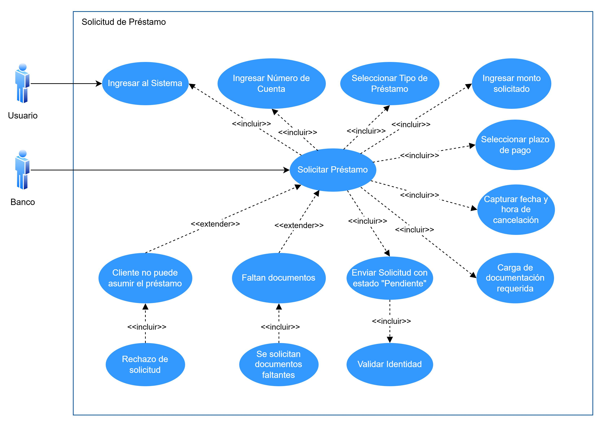

# Manual Tecnico - Proyecto - Grupo 7

### CDU de Alto nivel

#### Módulo de Atención al Cliente
1. Creacion de Cuenta Bancaria Normal y en Dólares

2. Actualización de Datos del Cliente

3. Creación de Tarjetas de Crédito o Débito

4. Bloqueo de Tarjetas de Crédito o Débito

5. Solicitud de Cancelación de Cuenta o Tarjeta

6. Encuesta de Satisfacción

7. Solicitud de Préstamo

8. Registro de Quejas

## Requerimientos Funcionales

### Creacion de Cuenta Bancaria Normal y en Dólares
El empleado del banco encargado de la atención al cliente debe tener un módulo específico para crear nuevas cuentas bancarias en el sistema. Las cuentas pueden ser de dos tipos distintos:
* Con tipo de moneda de cambio local.
* Con tipo de moneda de cambio en dólares.

Debe ingresarse los datos del cliente vinculado, seleccionar si la cuenta es monetaria o de ahorro y el monto inicial. Debe de hacerse una validación de identidad para completar el proceso.

### Actualización de Datos del Cliente
Debe haber un módulo para el encargado de atención al cliente para actualizar datos de los clientes. Debe de verificarse la identidad del cliente respondiendo la pregunta de seguridad registrada durante la creación de la cuenta bancaria. Al completar el proceso debe de guardarse en el historial los cambios realizados incluyendo la fecha y hora.

### Creación de Tarjetas de Crédito o Débito
Debe ser posible para el encargado de atención al cliente poder crear nuevas targetas de crédito o débito. Para completar el proceso debe de enviarse la solicitud con estado pendiente al supervisor para que pueda aprobarla o rechazarla. Antes de enviar la solicitud debe de realizarse una verificación de identidad.

### Bloqueo de Tarjetas de Crédito o Débito
Debe existir un módulo para que el encargado de atención al cliente pueda realizar bloqueos a tarjetas de crédito o débito por cualquiera de los motivos siguientes:
* Robo
* Pérdida
* Fraude

Para completar el proceso debe de notificarse al titular de la tarjeta del bloqueo exitoso y generar un reporte al equipo correspondiente para el análisis de fraude, en caso de ser necesario.

### Solicitud de Cancelación de Cuenta o Tarjeta
El empleado encargado de atención al cliente debe de poder emitir solicitudes de cancelación de cuentas o tarjetas de crédito o débito. Debe de enviarse la solicitud con estado pendiente al supervisor para que pueda aprobarla o rechazarla. Para completar el proceso es necesario que el supervisor examine el perfil del cliente para tomar la decisión de la solicitud.

### Encuesta de Satisfacción
Los clientes pueden evaluar la atención al cliente, servicios, productos, etc., mediante una encuesta. Al finalizar la encuesta se debe de puntuar el área evaluada. Completada la encuesta, los datos se guardan para posteriormente realizar análisis.

### Solicitud de Préstamo
El sistema debe tener un módulo de solicitud de préstamos que permite a los encargados de atención al cliente gestionar préstamos para los clientes. Es necesario ingresar datos como número de cuenta y monto solicitado. También se debe seleccionar el tipo de préstamo y el plazo en que se pagará el préstamo. Los clientes deberán cargar documentación requerida en PDF, y la autorización final recae en el supervisor.  
El sistema debe realizar un análisis automático de la capacidad de pago del cliente, verificando si no tiene alguna deuda actual.  
Deben establecerse tasas de interés dinámicas basadas en el historial crediticio del cliente y el tipo de préstamo.  
Las solicitudes rechazadas deben incluir una justificación clara y recomendaciones para el cliente.  
El Encargado de dar autorización de los prestamos es el supervisor.

### Registro de Quejas
Debe de permitirse registrar quejas hechas por los clientes. Debe registrarse los detalles de la queja, los datos importantes del cliente como su número de cuenta, etc. y el servicio del que se va a presentar la queja. Al completarse el registro de la queja se envía automáticamente un correo electrónico al supervisor para notificar sobre el incidente.

## Requerimientos No Funcionales

### Seguridad
Los datos personales y financieros de los clientes deben ser cifrados tanto en tránsito como en reposo. Las preguntas de seguridad y contraseñas deben utilizar algoritmos de encriptación robustos.  
Todo acceso a módulos sensibles debe requerir autenticación y autorización, garantizando que solo usuarios válidos y con permisos adecuados puedan interactuar con el sistema.

### Usabilidad
La interfaz de usuario debe ser intuitiva y accesible, garantizando que los clientes puedan completar las tareas en un máximo de 3 pasos por módulo.

### Escalabilidad
El sistema debe ser capaz de ampliarse para soportar el crecimiento futuro del banco, permitiendo agregar nuevas funcionalidades sin afectar el rendimiento de los módulos existentes.

### Mantenibilidad
Debe ser posible realizar actualizaciones o correcciones sin interrumpir el servicio, utilizando un modelo de despliegue continuo (CI/CD).

### Auditoría y Registro
Todas las acciones realizadas en el sistema deben registrarse en un historial con detalles como fecha, hora, usuario y acción realizada.

### Conformidad Legal
El sistema debe cumplir con las normativas locales e internacionales aplicables, como la Ley de Protección de Datos Personales y regulaciones bancarias específicas.