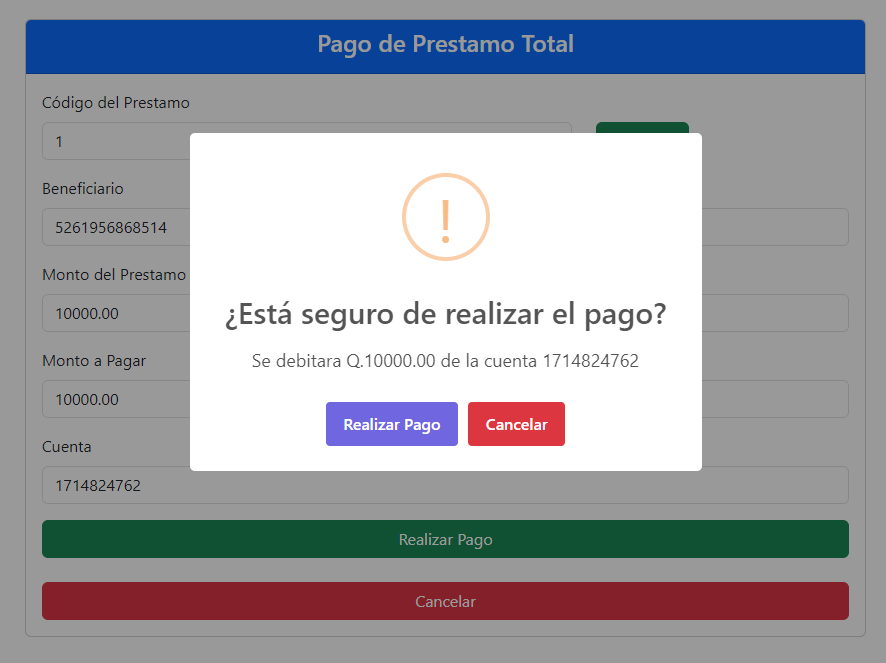
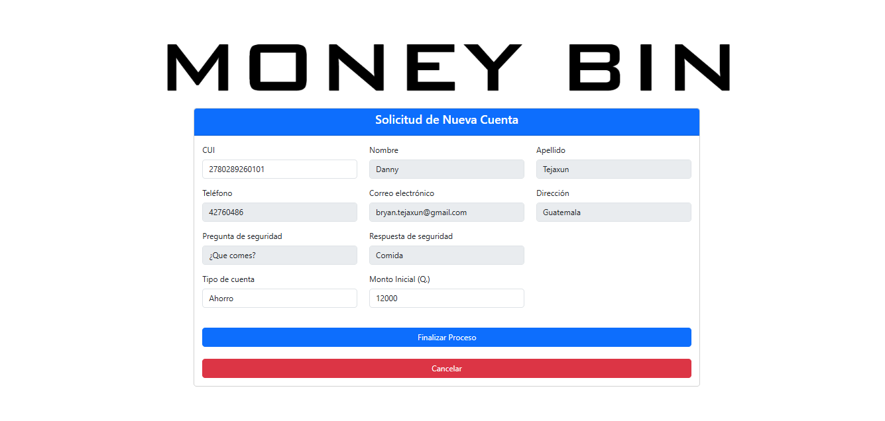
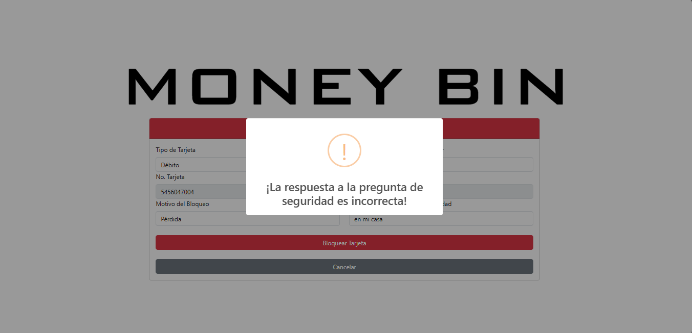

# Manual de Usuario - [Money Bin]

## Introducción

Bienvenido al Manual de Usuario de MoneyBin. Este documento tiene como objetivo proporcionarte las instrucciones necesarias para utilizar la aplicación de manera eficiente.

## Requisitos del Sistema

- **Sistema Operativo**: Windows 10, macOS 10.15, Ubuntu 20.04
- **RAM**: 4 GB
- **Espacio en Disco**: 500 MB libres
- **Navegador Compatible**: Chrome, Firefox

## Instalación

El sistema es una aplicacion web al cual se accede a travez de internet y un navegador, por lo tanto no se requeriria de ninguna instalación.

## Módulo Cajero

### Inicio de Sesión

1. Abre la aplicación.
2. Introduce tu usuario y contraseña.
3. Haz clic en "Iniciar Sesión".

### Menu Principal

    * Permite navegar a los distintos modulos de la aplicación presionando los respectivos botones.

### Funciones Principales

#### Pago de Servicios

1. Presionar el btón "Pago de Servicios"

    

2. Seleccionar el servicio

    

3. Seleccionar metodo de pago

    

4. Consultar el servicio

    

    1. Debe cingresar el codigo proporcionado por el cliente.
    2. Debe confirmar con el cliente la información que se muestra del servicio.
    3. Si es pago por transferencia debe ingresar el numero de cuenta proporcianada por el cliente.
    4. Presionar el botón ""Realizar Pago".

5. Verificar y confirmar

    

6. Ver Confirmación de Pago

    

        * Se debe generar el comprobante del pago presionando el botón "Generar Comprobante".

#### Pago de Prestamos

1. Presionar el btón "Pago de Prestamos"

    

2. Seleccionar el Tipo de Pago

    

3. Consultar el Prestamo

    

    1. Debe ingresar el codigo proporcionado por el cliente.
    2. Debe confirmar con el cliente la información que se muestra del servicio.
    3. Si es pago parcial se debe ingresar el monto que el cliente desea abonar.
    4. Si es pago con transferencia, se debe ingresar la cuenta proporcionada por el cliente.
    5. Presionar el botón ""Realizar Pago".

4. Verificar y confirmar

    

5. Ver Confirmación de Pago

    

        * Se debe generar el comprobante del pago presionando el botón "Generar Comprobante".

#### Generar Comprobantes
Luego de la respectiva consulta de cliente se muestra el historial de transacciones, para cada transacción se puede tenerar un comprobante en formato pdf al dar click en el botón "Generar".

#### Buscar Cuentas
Es posible buscar cuentas de usuarios mediante el número de una de sus cuentas asociadas o mediante su CUI.

1. Se debe ingresar el número de cuenta asociada o el CUI del cliente para localizarlo.

2. Luego se presiona el botón "Consultar" que mostrará como resultado los datos de contacto del usuario y el historial de las transacciones que ha realizado.

#### Mostrar Saldo
1. Primero debe de ingresarse el número de CUI del cliente asociado a la cuenta que se desa consultar. Luego dar click en el botón "Consultar".

2. Luego debe de seleccionarse una de las cuentas asociadas al cliente. Luego dar click en el botón "Consultar".

3. Por último se podrá visualizar la cuenta incluyendo datos como el saldo actual, principalmente, luego datos como el número, el titular y la última fecha en que fue actualizada.

#### Retiro de Dinero

1. Presionar el botón "Retiros"

    

2. Ingresar el numero de cuenta

    

3. Verificar los datos e ingresar el monto a retirar

    

    1. Debe cingresar el numero de cuenta proporcionada por el cliente
    2. Debe confirmar con el cliente la información que se muestra del servicio.
    3. Se debe ingresar el monto indicado por el cliente.
    4. Presionar el botón ""Retirar".

4. Ver Confirmación de Retiro

    

        * Se debe generar el comprobante del pago presionando el botón "Generar Comprobante".

#### Deposito de Dinero

## Módulo Atencion al Cliente

### Menú

* Permite navegar a los distintos modulos de la aplicación presionando los respectivos botones.

### Funciones Principales
#### Creación de Cliente y Cuenta

1. Ingresar el CUI del cliente.
    - Si el cliente no existe en el sistema aún, se ingresarán los datos manualmente para que pueda ser registrado junto con su cuenta bancaria.
    - Si el cliente ya existe en el sistema los campos correspondientes se autocompletan.

    

2. Completar el formulario seleccionando el tipo de cuenta y el monto inicial.

    

3. Se muestra la ventana de confirmación antes de finalizar el proceso.

    

4. Se muestra el mensaje de confirmación y se redirije al menú.

    

#### Actualización de Cliente
1. Seleccionar el cliente que se necesite modificar y los campos respectivos se autocompletarán.

    

2. Modificar los campos que se requieran. Los campos editables son:
    - Teléfono
    - Correo Electrónico
    - Dirección
    - Pregunta de Seguridad
    - Respuesta de Seguridad

    

3. Se muestra la ventana de confirmación antes de finalizar el proceso.

    

4. Se muestra el mensaje de confirmación y se redirije al menú.

    

#### Solicitar Tarjeta

* Se debe seleccionar el tipo de tarjeta de crédito.

##### Tarjeta de Crédito

1. Se debe de ingresar el límite de crédito e ingresar el CUI del cliente. El campo con los datos del titular se autocompletará si el CUI es correcto. De lo contrario no se puede completar la solicitud.

    

2. Se muestra la ventana de confirmación antes de finalizar el proceso.

    

##### Tarjeta de Débito

1. Se debe de ingresar el número de cuenta a la que se quiere asociar la tarjeta. El campo con los datos del titular se autocompletará si el número de cuenta es correcto. De lo contrario no se puede completar la solicitud.

    

2. Se muestra la ventana de confirmación antes de finalizar el proceso.

    

* Si el cliente ha solicitado una tarjeta de cualquier tipo y aún hay una solicitud sin aprovación no se podrá finalizar el proceso actual.

    

* Se muestra el mensaje de confirmación y se redirije al menú.

    

#### Bloquear Tarjeta

1. Después de seleccionar el tipo de tarjeta se ingresa el CUI o número de cuenta asociado a la tarjeta.

    

2. Si el CUI o número de cuenta es correcto los campos se autocompletan. De lo contrario no se puede completar el proceso.

    

3. Se muestra la ventana de confirmación antes de finalizar el proceso.

    

4. Si la respuesta de seguridad es incorrecta se muestra la alerta.

    

5. Se muestra el mensaje de confirmación y se redirije al menú.

    

## Modulo Supervisor

## Modulo Administrador de Sistemas