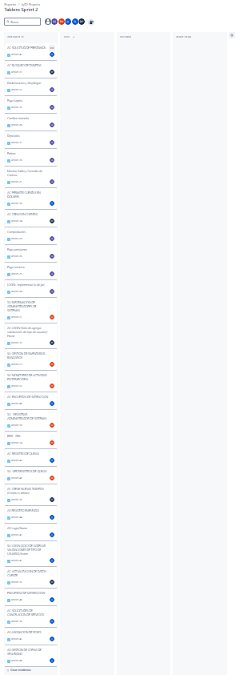
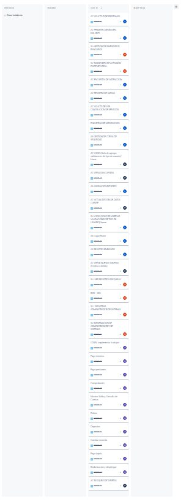
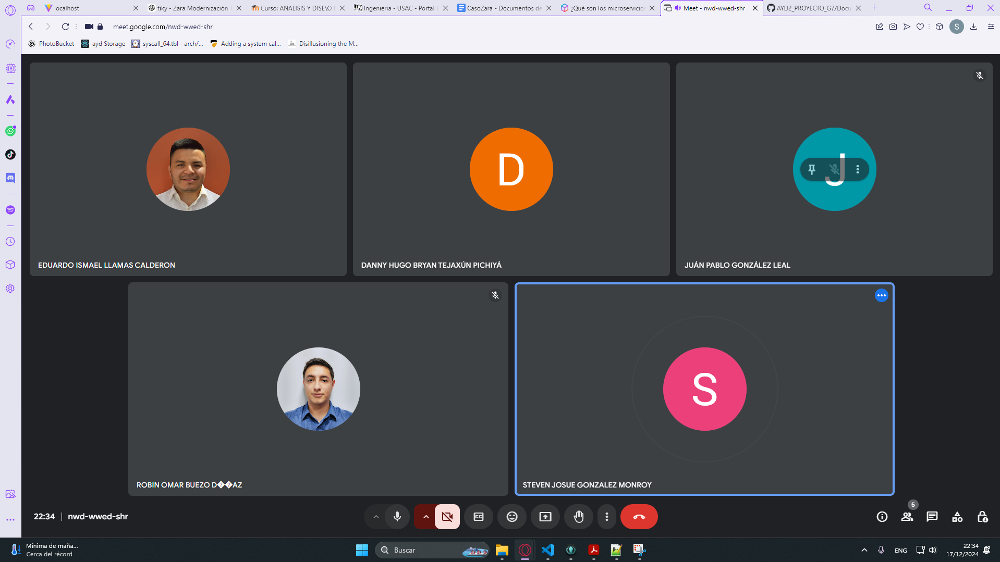
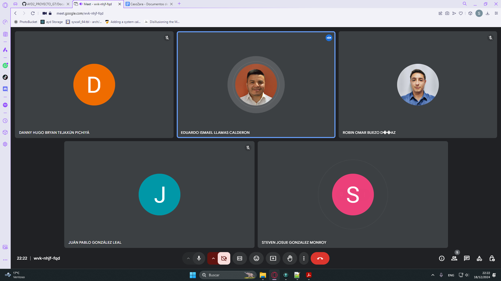
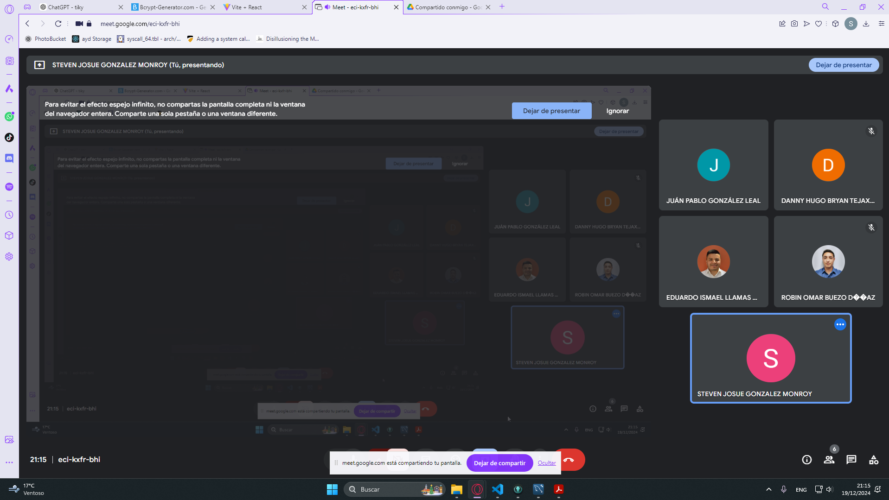
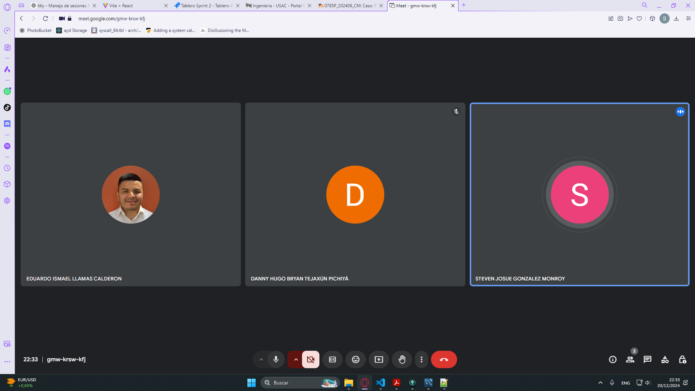
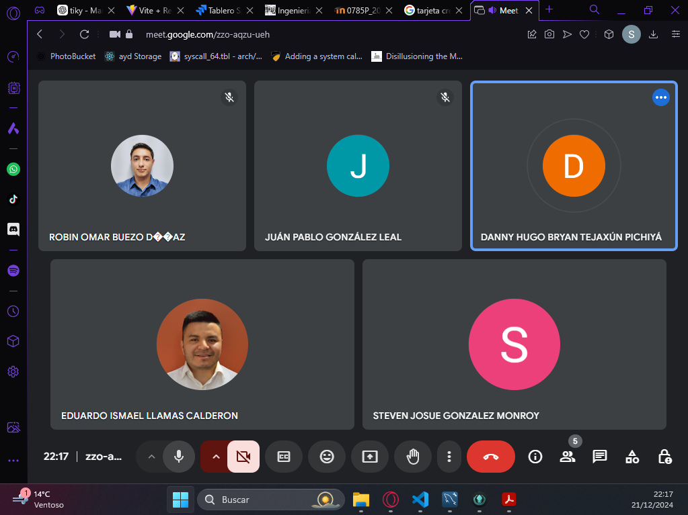
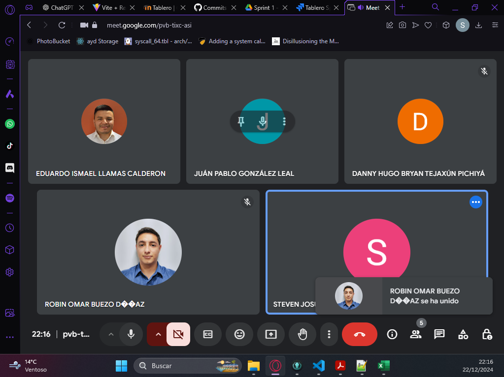

# Money Bin - Sprint 1 - Grupo 7

## Sprint Backlog

## Sprint Backlog

| Persona | Área | Tareas | Estado | Comentario |
|---------|------|--------|--------|------------|
| **Steven** | **Cajero** | | | |
|  |  | - BI-01: Implementar JWT para Login | Completado | |
|  |  | - BI-02: Pago servicios | Completado | |
|  |  | - BI-03: Pago préstamos | Completado | |
|  |  | - BI-04: Buscar por cuentas | Completado | |
|  |  | - BI-05: Mostrar saldo | Completado | |
|  |  | - BI-06: Cambiar moneda | Completado | |
|  |  | - BI-07: Comprobantes | Completado | |
|  |  | - BI-08: Retiros | Completado | |
|  |  | - BI-09: Depósitos | Completado | |
|  |  | - BI-10: Pago tarjeta | Completado | |
|  |  | - BI-11: Dockerizacion y Despliegue | Completado | |
| **Danny** | **Atención al Cliente** | | | |
|  |  | - BI-12: Login (validaciones de tipo de usuario) / Home | Completado | |
|  |  | - BI-13: Creación cuentas | Completado | |
|  |  | - BI-14: Actualización de datos cliente | Completado | |
|  |  | - BI-15: Crear nuevas tarjetas (crédito o débito) | Completado | |
|  |  | - BI-16: Bloqueo de tarjetas | Completado | |
| **Eduardo** | **Atencion al Cliente** | | | |
|  |  | - BI-17: Solicitudes de cancelación de servicios | Completado | |
|  |  | - BI-18: Permitir cuentas en dólares |Completado | |
|  |  | - BI-19: Encuestas de satisfacción |Completado | |
|  |  | - BI-20: Solicitud de préstamos |Completado | |
|  |  | - BI-21: Registro de quejas |Completado | |
| **Juanpa** | **Administrador de Sistemas** | | | |
|  |  | - BI-22: Login / Home |Completado | |
|  |  | - BI-23: Registro empleado | Completado| |
|  |  | - BI-24: Asignación de roles |Completado | |
|  |  | - BI-25: Gestión de copias de seguridad |Completado | |
|  | **Supervisor** | | | |
|  |  | - BI-26: Login (validaciones de tipo de usuario) / Home |Completado | |
|  |  | - BI-27: Encuestas de satisfacción |Completado | |
| **Robin** | **Supervisor** | | | |
|  |  | - BI-28: BDD | Completado | |
|  |  | - BI-39: DDL | Completado | |
|  |  | - BI-30: Ver registros de quejas | Completado | |
|  |  | - BI-31: Registrar administrador de sistemas | Completado| |
|  |  | - BI-32: Información de administradores de sistemas | Completado| |
|  |  | - BI-33: Monitoreo de actividad en tiempo real |Completado | |
|  |  | - BI-34: Gestión de inventarios bancarios |Completado | |

---

## Sprint Planning

#### Enlace

[Planning](https://drive.google.com/file/d/1wAdxQ8Hu6YCOT-1oIHH7EFGKt9Rn5EvL/view?usp=sharing)

### Duración del Sprint

1 Semana : 16/12/2024 - 23/12/2024

### Objetivo del Sprint

Durante este sprint, el objetivo principal es desarrollar y desplegar manualmente aproximadamente el 80% del sistema bancario **Money Bin**, logrando una base sólida para las operaciones bancarias fundamentales. Se busca cubrir los siguientes módulos clave:

1. **Módulo Cajero**
   - Implementar funcionalidades esenciales como gestión de pagos, retiros, depósitos, y consulta de saldo, garantizando una experiencia de usuario fluida y segura.

2. **Módulo Atención al Cliente**
   - Desarrollar herramientas para la creación y gestión de cuentas, soporte al cliente, y administración de tarjetas, priorizando la interacción eficiente con los usuarios.

3. **Módulo Supervisor**
   - Incorporar capacidades para monitorear actividades y gestionar encuestas de satisfacción, fortaleciendo el control y supervisión del sistema.

4. **Módulo Administrador de Sistemas**
   - Establecer las bases para la gestión de empleados, asignación de roles, y copia de seguridad, asegurando la estabilidad y seguridad del sistema.

Este enfoque garantizará que los módulos principales estén operativos, permitiendo su uso y evaluación inicial mientras se avanza hacia el desarrollo completo del sistema en futuros sprints.

---

## Tablero al Inicio del Sprint

## Tablero al Final del Sprint

## Daily meetings

### Daily 1 - 17/12/2024

#### Participantes

- **Steven González**
- **Robin Buezo**
- **Danny Tejaxun**
- **Eduardo Llamas**
- **Juan Pablo González**

#### Avances e impedimentos

| Integrante              | Tarea Realizada (Día Anterior)  | Impedimentos                                                   |
|-------------------------|---------------------------------|----------------------------------------------------------------|
| **Steven González**     | NA                              | Se priorizó la realización del caso Zara de la clase magistral |
| **Robin Buezo**         | NA                              | Se priorizó la realización del caso Zara de la clase magistral |
| **Danny Tejaxun**       | NA                              | Se priorizó la realización del caso Zara de la clase magistral |
| **Eduardo Llamas**      | NA                              | Se priorizó la realización del caso Zara de la clase magistral |
| **Juan Pablo González** | NA                              | Se priorizó la realización del caso Zara de la clase magistral |

---

### Daily 2 - 18/12/2024

#### Participantes

- **Steven González**
- **Robin Buezo**
- **Danny Tejaxun**
- **Eduardo Llamas**
- **Juan Pablo González**

#### Avances e impedimentos

| Integrante              | Tarea Realizada (Día Anterior)                                 | Impedimentos                                            |
|-------------------------|----------------------------------------------------------------|---------------------------------------------------------|
| **Steven González**     | BI-01: Implementar JWT para Login                              | Retraso por entrega del caso Zara en la clase magistral |
| **Robin Buezo**         |                                                                |                                                         |
| **Danny Tejaxun**       | BI-12: Login (validaciones de tipo de usuario) / Home          |                                                         |
| **Eduardo Llamas**      |                                                                |                                                         |
| **Juan Pablo González** |                                                                |                                                         |

---

### Daily 3 - 19/12/2024

#### Participantes

- **Steven González**
- **Robin Buezo**
- **Danny Tejaxun**
- **Eduardo Llamas**
- **Juan Pablo González**

#### Avances e impedimentos

| Integrante              | Tarea Realizada (Día Anterior)                                 | Impedimentos                       |
|-------------------------|----------------------------------------------------------------|------------------------------------|
| **Steven González**     | BI-02: Pago servicios                                          |                                    |
| **Robin Buezo**         |                                                                |                                    |
| **Danny Tejaxun**       | BI-13: Creación cuentas                                        | Visita al médico                   |
| **Eduardo Llamas**      |                                                                |                                    |
| **Juan Pablo González** |                                                                |                                    |

---

### Daily 4 - 20/12/2024

#### Participantes

- **Steven González**
- **Robin Buezo**
- **Danny Tejaxun**
- **Eduardo Llamas**
- **Juan Pablo González**

#### Avances e impedimentos

| Integrante              | Tarea Realizada (Día Anterior)                                 | Impedimentos                       |
|-------------------------|----------------------------------------------------------------|------------------------------------|
| **Steven González**     | BI-03: Pago Prestamos                                          |                                    |
|                         | BI-04 Busqueda clientes                                        |                                    |
|                         | BI-05 : Consulta Saldos                                        |                                    |
| **Robin Buezo**         |                                                                |                                    |
| **Danny Tejaxun**       | BI-14: Actualización de datos cliente                          | Visita al médico                   |
| **Eduardo Llamas**      |                                                                |                                    |
| **Juan Pablo González** |                                                                |                                    |

---

### Daily 5 - 21/12/2024

#### Participantes

- **Steven González**
- **Robin Buezo**
- **Danny Tejaxun**
- **Eduardo Llamas**
- **Juan Pablo González**

#### Avances e impedimentos

| Integrante              | Tarea Realizada (Día Anterior)                            | Impedimentos                       |
|-------------------------|-----------------------------------------------------------|------------------------------------|
| **Steven González**     | BI-06: Cambio Moneda                                      |                                    |
|                         | BI-07: Comprobante                                        |                                    |
|                         | BI-08: Retiros                                            |                                    |
|                         | BI-08: Depositos                                          |                                    |
| **Robin Buezo**         |                                                           |                                    |
| **Danny Tejaxun**       | BI-15: Crear nuevas tarjetas (crédito o débito)           |                                    |
| **Eduardo Llamas**      |                                                           |                                    |
| **Juan Pablo González** |                                                           |                                    |

---

### Daily 6 - 22/12/2024

#### Participantes

- **Steven González**
- **Robin Buezo**
- **Danny Tejaxun**
- **Eduardo Llamas**
- **Juan Pablo González**

#### Avances e impedimentos

| Integrante              | Tarea Realizada (Día Anterior)                                 | Impedimentos                       |
|-------------------------|----------------------------------------------------------------|------------------------------------|
| **Steven González**     | BI-10: Pago de Tarjetas                                        |                                    |
|                         | BI-11: Dockerización  y Despliegue                             |                                    |
| **Robin Buezo**         |                                                                |                                    |
| **Danny Tejaxun**       | BI-16: Bloqueo de tarjetas                                     |                                    |
| **Eduardo Llamas**      |                                                                |                                    |
| **Juan Pablo González** |                                                                |                                    |

## Sprint Retrospective - Sprint 1

**Fecha:** [Fecha de la retrospectiva]  
**Enlace de video:** [retrospective](https://drive.google.com/file/d/1Kl0Q8MGXcVCTVI-Xo2n4wDmb-puEQRNu/view?usp=sharing)
**Participantes:**  

1. Steven Gonzalez  
2. Danny Tejaxun  
3. Eduardo Llamas  
4. Robin Buezo  
5. Pablo Gonzalez

---

## **1. Qué funcionó bien**

**Comentarios del equipo:**  

- **Steven Gonzalez:**: Que a pesar de la alta carga de actividades en la semana, logramos hacer entrega de todo, si bien no al 100% pero si todo. 
- **Danny Tejaxun:** Hubo comunicación efectiva, pudimos ponernos de acuerdo en tiempos cortos.
- **Eduardo Llamas:** Buena Asignación de tareas, fue facil repartir el trabajo, y como manejamos las ramas del proyecto. 
- **Robin Buezo:** [Comentario positivo]  Se asignaron las tareas desde un inicio y eso ayudo a no retrasarnos, tambien que cuando algo estaba en el aire y no sabiamos quien debia hacer algo, siempre entre todos buscabamos una solución, no nos limitamos unicamente a nuestras asignaciones personales.
- **Pablo Gonzalez:** Todos nos apoyamos a resolver dudas, a pesar del poco tiempo, siempre entre otros miembros nos apoyamos.

---

## **2. Qué no funcionó**

**Comentarios del equipo:**  

- **Steven Gonzalez:** Dimos un mal enfoque a las actividades, algunos dias dejamos de avanzar en el proyecto por avanzar en otros cursos o actividades de la magistral.
- **Danny Tejaxun:** Subestimamos algunas tareas, y nos llevaron mas tiempo de lo que esperabamos.  
- **Eduardo Llamas:** Mala priorización de actividades, lo que mas afectó fue el trabajo y otros cursos que estamos llevando.
- **Robin Buezo:** Al momento de dividir las tareas, algunas estuvieron en el aire, algunos tuvimos mas carga que otros entonces algunas tareas quedaron pendientes.  
- **Pablo Gonzalez:** Personalmente, de tanta carga semanal aveces uno terminaba bloqueado, el no saber manejar las cargas causó que se dieran esos bloqueos.

---

## **3. Qué debemos mejorar**

- **Steven Gonzalez:** El enfoque hacia el curso, priorizarlo mas y tratar de hacer lo mas rapido posible las asignaciones de este curso.
- **Danny Tejaxun:** Mejorar el enfoque de las reuniones, analizar mejor, mas precisas y un poco mas cortas. 
- **Eduardo Llamas:** Tener una mejor planificación del lado personal, para terminar las asignaciones a tiempo y cumplir.
- **Robin Buezo:** Tratar de analizar y granular mejor las tareas y tratar de dividirlas mejor, y organizarnos mejor y tratar de acoplar mejor nuestro tiempo.
- **Pablo Gonzalez:** Colocar objetivos diarios mas especificos, y mejorar mi organización personal de tiempo.

