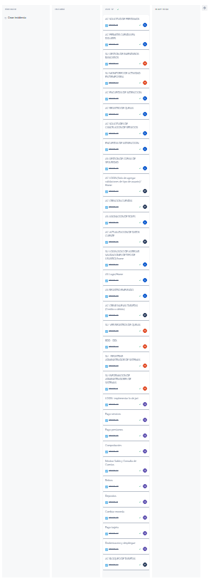

# Money Bin - Sprint 2 - Grupo 7

## Sprint Backlog

| Persona | Área | Tareas | Estado | Comentario |
|---------|------|--------|--------|------------|
| **Steven** | | | |
|  |  | - BI-01: Pruebas E2E | Completado | |
|  |  | - BI-02: CICD Backend | Completado | |
|  |  | - BI-03: Terraform | Completado | |
|  |  | - BI-04: Ansible| Completado | |
| **Danny** || | | |
|  |  | - BI-05: Pruebas Aceptación| Completado | |
|  |  | - BI-06: AC - Solicitud de prestamos al banco | Completado | |
| **Eduardo** || | | |
|  |  | - BI-07: Modificar información de empleado | Completado | |
|  |  | - BI-08: Pruebas de Integración |Completado | |
| **Juanpa** || | | |
|  |  | - BI-09: Aceptar Prestamos | | |
|  |  | - BI-10: Pruebas no funcionales | Completado| |
| **Robin** | | | | |
|  |  | - BI-11: Aprobar Cancelación de Servicios | Completado | |
|  |  | - BI-12: Pruebas Unitarias | Completado | |
|  |  | - BI-13: Implementación de patron Command | Completado | |

---

## Sprint Planning

### Enlace

[Planning](https://drive.google.com/file/d/1ea7cHAbR1mYjBs9apsaW7cYD3vR6LT6h/view?usp=sharing)

### Duración del Sprint

1 Semana : 26/12/2024 - 28/12/2024

### Objetivo del Sprint

Durante este sprint, el objetivo principal terminar de desarrollar la plataforma MoneyBin e implementar test, CICD y despliegue con Terraform y Ansible

---

## Tablero al Inicio del Sprint

## Tablero al Final del Sprint

## Daily meetings

### Daily 1 - 27/12/2024

#### Participantes

- **Steven González**
- **Robin Buezo**
- **Danny Tejaxun**
- **Eduardo Llamas**
- **Juan Pablo González**

#### Avances e impedimentos

| Integrante              | Tarea Realizada (Día Anterior) | Impedimentos                                                   |
| ----------------------- | ------------------------------ | -------------------------------------------------------------- |
| **Steven González**     | BI-01 Pruebas E2E              |               |
| **Robin Buezo**         |                                |               |
| **Danny Tejaxun**       | BI-06: AC - Solicitud de prestamos al banco |               |
| **Eduardo Llamas**      |                                |               |
| **Juan Pablo González** |                                |               |

---

### Daily 2 - 28/12/2024

#### Participantes

- **Steven González**
- **Robin Buezo**
- **Danny Tejaxun**
- **Eduardo Llamas**
- **Juan Pablo González**

#### Avances e impedimentos

| Integrante              | Tarea Realizada (Día Anterior)                                 | Impedimentos                                            |
|-------------------------|----------------------------------------------------------------|---------------------------------------------------------|
| **Steven González**     | BI-02: CICD Backend                                            |                                                         |
|                         | BI-03: Terraform                                               |                                                         |
|                         | BI-04: Ansible                                                 |                                                         |
| **Robin Buezo**         |                                                                |                                                         |
| **Danny Tejaxun**       | BI-05: Pruebas Aceptación                                      |                                                         |
| **Juan Pablo González** |                                                                |                                                         |
| **Eduardo Llamas**      |                                                                |                                                         |

---

## Sprint Retrospective - Sprint 2

**Fecha:** 28-12-2024
**Enlace de video:** [retrospective](https://drive.google.com/file/d/191IjHtq1-dOGL1OvOx0SJZyWxYZhDVyV/view?usp=sharing)
**Participantes:**  

1. Steven Gonzalez  
2. Danny Tejaxun  
3. Eduardo Llamas  
4. Robin Buezo  
5. Pablo Gonzalez

---

## **1. Qué funcionó bien**

**Comentarios del equipo:**  

- **Steven Gonzalez:**: Todos asistieron a las reuniones, todos colaboraron activamente en el grupo y comunicandose, y todos ayudaron en el planning poker
- **Danny Tejaxun:** Ahorramos timempo adelantando tareas de esta fase en la fase anterior.
- **Eduardo Llamas:** Buena distribucion de tareas con el planning poker y buena priorización de las tareas.
- **Robin Buezo:** Lo que nos ha funcionado bien es que cada uno ha sabido resolver sus asignaciones y ser responsables con las entregasy la buena distribucion de las asignaciones.
- **Pablo Gonzalez:** La planificación ha estado bastante bien, y trabajar el planning poker nos llevo a tener un punto de vista mejor de la dificultad de las tareas

---

## **2. Qué no funcionó**

**Comentarios del equipo:**  

- **Steven Gonzalez:**: Que el sprint quedó en fechas festivas (Navidad y noche buena) esto afecto en el timepo para realizar las asignaciones.
- **Danny Tejaxun:**: Desconociamos que hacer para ciertos tipos de pruebas lo cual generó dudas incluso en el planning poker.
- **Eduardo Llamas:** Las fechas del sprint nos afectaron y confiarnos con la fecha de entrega, eso hizo que nos relajaramos y al final tener que correr.
- **Robin Buezo:** Nos afecto el tema de las fechas festivas, donde en esos dias no trabajamos y se nos acortó mucho el sprint, y no tuvimos el tiempo suficiente para cumplir con todas las asignaciones, aunque es algo que se nos sale de las manos.
- **Pablo Gonzalez:** Por el tiempo, no nos percatamos de aspectos responsivos de la interfaz, y con las pruebas de usabilidad se pierde el test en otros dispositivos.

---

## **3. Qué debemos mejorar**

- **Steven Gonzalez:** Tratar de no acumular tareas para los ultimos dias del sprint.
- **Danny Tejaxun:** Desde un inicio investigar que es cada que no entendamos para tener claro que hacer.
- **Eduardo Llamas:** Debemos tomar cierta cadencia a pesar de los asuetos y fechas festivas, debemos tratar de llevar un ritmo al ir agregando valor al proyecto.
- **Robin Buezo:** Tener una vision mas amplia no solo del sprint actual, sino tener una vision mas amplia del backlog completo, y asi al definir los sprints tomar en cuenta los dias festivos y retrasos que pudieran haber en cuanto a fechas, para hacer una mejor distribucion del backlog.
- **Pablo Gonzalez:** Tratar de avanzar y adelantar ciertas tareas, tomar la iniciativa de avances y no  dejar nada para posteriores sprints.
