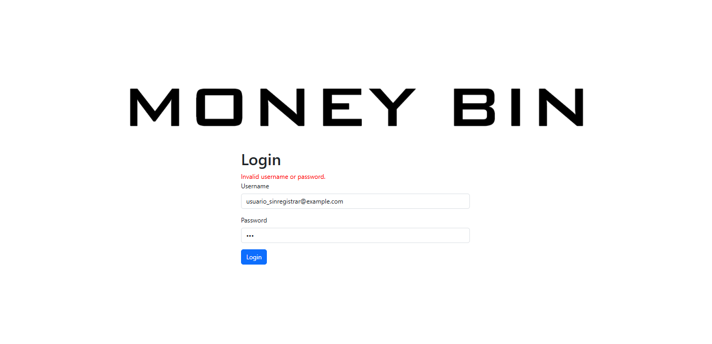
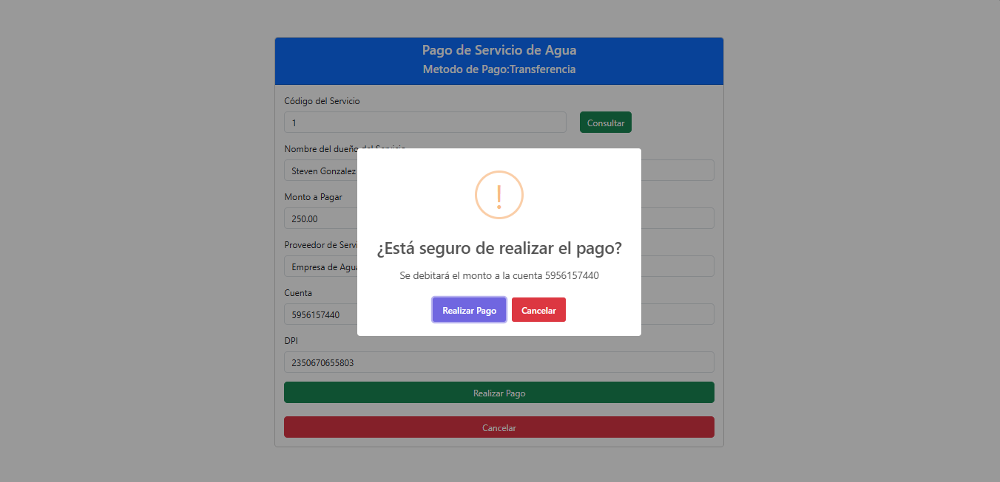

# Pruebas de Aceptación - Proyecto - Grupo 7

## Resumen
| Código |        Prueba        |    Rol Asociado     | Resultado |
|   -    |          -           |          -          |     -     |
| PA-01  | Inicio de Sesión     | Todos los roles     | APROBADO  |
| PA-02  | Pago de Servicios    | Cajero              | APROBADO  |
| PA-03  | Creación de Cuentas  | Atención al Cliente | APROBADO  |
| PA-04  | Creación de Tarjetas | Atención al Cliente | APROBADO  |
| PA-05  | - | - | APROBADO |

## PA-01. Inicio de Sesión
* **Objetivo**: Verificar que los usuarios pueden iniciar sesión correctamente y que se validan las credenciales.
* **Precondiciones**
    - Tener usuarios registrados con credenciales válidas.
* **Entradas**
    - Correo electrónico
    - Contraseña
    - Nombre de usuario
* **Escenarios**
    - Iniciar sesión con credenciales correctas.
        - Ingreso de credenciales.  
            
        - Módulo Administrador
            - Entrada exitosa.  
                
        - Módulo Cajero.  
            - Entrada exitosa.  
                
        - Módulo Supervisor.  
            - Carga de archivo clave `.ayd`.  
                
            - Entrada exitosa.  
                
        - Módulo Atención al Cliente.  
            - Entrada exitosa.  
                
    - Intentar iniciar sesión con una contraseña incorrecta.
        
    - Intentar iniciar sesión con un correo no registrado.
        
* **Resultados**
    - Todos los inicios de sesión resultaron exitosos con cada uno de los distintos roles.
    - Mensaje de error para credenciales incorrectas.

## PA-02. Pago de Servicios (Módulo Cajero)
* **Objetivo**: Validar que el sistema permita registrar pagos de servicios básicos correctamente.
* **Precondiciones**
    - Tener configurados servicios básicos.
    - Tener cuentas bancarias en el sistema.
* **Entradas**
    * Datos del titular
    * Código de servicio
    * Monto
    * Número de cuenta (si aplica)
* **Escenarios**
    * Realizar un pago en efectivo.
        - Pago de Servicio de Luz.  
            
            
    * Realizar un pago desde una cuenta bancaria.
        - Pago de Servicio de Agua.  
            
            
    * Intentar realizar un pago con datos incompletos.
        - Se muestra un mensaje de error en caso de que alguno de los campos permanezca vacío y se intente completar la operación.  
            
* **Resultados**
    * Todos los pagos se realizaron exitosamente cuando se ingresaron datos en todos los campos obligatorios.
    * Mensaje de error cuando algún campo obligatorio permaneció vacío.

## PA-03. Creación de Cuentas (Módulo Atención al Cliente)
* **Objetivo**: Validar que el sistema permita la creación de cuentas bancarias correctamente.
* **Precondiciones**
    - Es opcional tener clientes registrados previamente.
        - Si no hay clientes registrados previamente se crean en ese momento de forma automática.
        - Si ya existen clientes registrados únicamente se obtienen los datos necesarios para completar el formulario.
* **Entradas**
    * Datos del cliente
    * Tipo de cuenta
    * Tipo de moneda
    * Monto inicial
* **Escenarios**
    * Crear una cuenta bancaria monetaria en quetzales.
        
        
    * Crear una cuenta bancaria de ahorro en dólares.
        
        
    * Intentar crear una cuenta con datos incompletos.
        
* **Resultados**
    * Las cuentas fueron creadas exitosamente cuando se ingresaron los datos correspondientes con sus respectivas validaciones.
    * Mensajes de alerta claros cuando alguno de los campos obligatorios permaneció vacío.

## PA-04. Creación de Tarjetas (Módulo Atención al Cliente)
* **Objetivo**: Validar que el sistema permita a los usuarios crear una nueva tarjeta correctamente, almacenando los datos ingresados y mostrando un mensaje de confirmación al finalizar.
* **Precondiciones**
    - El usuario debe estar autenticado en el sistema.
    - El usuario debe tener rol de atención al cliente para crear una tarjeta.
* **Entradas**
    * Tipo de tarjeta (crédito o débito)
    * Límite de crédito (si aplica)
    * CUI del titular (si aplica)
    * Número de cuenta (si aplica)
* **Escenarios**
    * Crear una tarjeta de crédito.
        - Formulario.
            
        - Confirmación.
            
        - Mensaje exitoso.
            
    * Crear una tarjeta de débito.
        - Formulario.
            
        - Confirmación.
            
        - Mensaje exitoso.
            
    * Intentar crear una tarjeta cuando el cliente tiene aún una solicitud vigente.
        
    * Intentar crear una tarjeta con datos incompletos.
        
* **Resultados**
    * Las solicitudes de creación de tarjetas se enviaron correctamente al llenar el formulario de la forma debida.
    * Mensajes de alerta claros cuando alguno de los campos permaneció vacío o hay una solicitud vigente