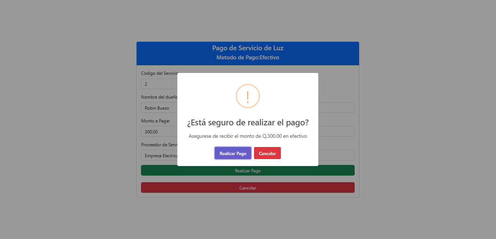

# Pruebas de Aceptación - Proyecto - Grupo 7

## PA-01. Inicio de Sesión
* **Objetivo**: Verificar que los usuarios pueden iniciar sesión correctamente y que se validan las credenciales.
* **Precondiciones**: Tener usuarios registrados con credenciales válidas.
* **Entradas**: Correo electrónico, contraseña, nombre de usuario.
* **Escenarios**
    - Iniciar sesión con credenciales correctas.
        - Ingreso de credenciales.  
            
        - Módulo Administrador
            - Entrada exitosa.  
                
        - Módulo Cajero.  
            - Entrada exitosa.  
                
        - Módulo Supervisor.  
            - Carga de archivo clave `.ayd`.  
                
            - Entrada exitosa.  
                
        - Módulo Atención al Cliente.  
            - Entrada exitosa.  
                
    - Intentar iniciar sesión con una contraseña incorrecta.
        
    - Intentar iniciar sesión con un correo no registrado.
        
* **Resultados**
    - Todos los inicios de sesión resultaron exitosos con cada uno de los distintos roles.
    - Mensaje de error para credenciales incorrectas.

## PA-02. Pago de Servicios
* **Objetivo**: Validar que el sistema permita registrar pagos de servicios básicos correctamente.
* **Precondiciones**: Tener configurados servicios básicos y cuentas bancarias en el sistema.
* **Entradas**: Datos del titular, código de servicio, monto, y número de cuenta (si aplica).
* **Escenarios**
    * Realizar un pago en efectivo.
        - Pago de Servicio de Luz.  
            
            
    * Realizar un pago desde una cuenta bancaria.
        - Pago de Servicio de Agua.  
            
            
    * Intentar realizar un pago con datos incompletos.
        - Se muestra un mensaje de error en caso de que alguno de los campos permanezca vacío y se intente completar la operación.  
            
* **Resultados**
    * Todos los pagos se realizaron exitosamente cuando se ingresaron datos en todos los campos obligatorios.
    * Mensaje de error cuando algún campo obligatorio permaneció vacío.